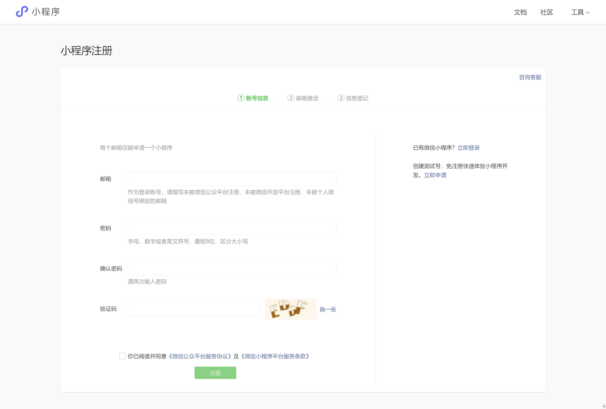
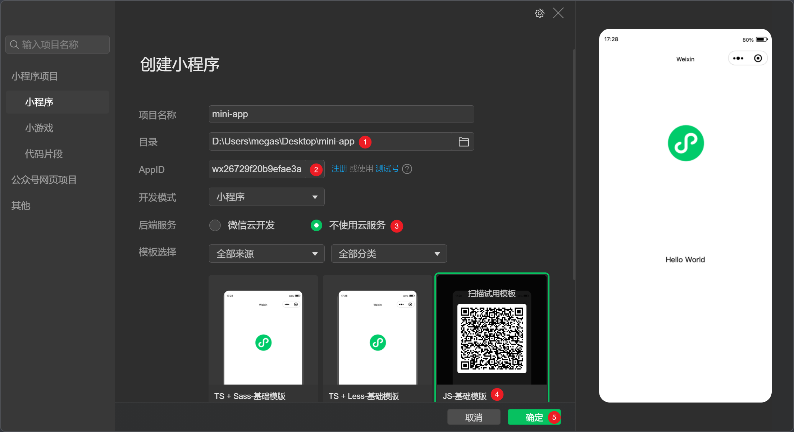

# 微信小程序开发 - 第 1 天

## 一、注册小程序账号

点击打开 [微信公众平台(管理后台)](https://mp.weixin.qq.com/) 通过邮箱注册小程序账号。


小程序账号注册，按微信平台要求填写如下表单，[点击注册](https://mp.weixin.qq.com/wxopen/waregister?action=step1)



::: tip 注意事项 👇

- **账号信息**：已申请过 公众号/订阅号 的邮箱**无法再使用**，需更换新邮箱
- **邮箱激活**：登录小程序注册填写的邮箱，按邮件提示激活即可
- **信息登记**：主体信息选**个人开发者**（PS：企业账号需按年付费认证）

:::

**账号注册成功后，即可扫码登录**👉 [微信公众平台](https://mp.weixin.qq.com/) 和 [微信开发者工具](https://developers.weixin.qq.com/miniprogram/dev/devtools/page.html)


## 二、搭建开发环境

1. [下载微信开发者工具](https://developers.weixin.qq.com/miniprogram/dev/devtools/stable.html)，双击安装程序根据引导完成安装
2. 启动安装后的程序，使用微信扫码登录（电脑需要联网）
3. 创建小程序，选择目录位置、填写 AppID、**选择不使用云服务**、**选择 JS-基础模板**
4. 在小程序开发工具中点预览在真机中查看小程序效果



::: danger 注意事项

如果 选择不使用云服务、选择 JS-基础模板 **操作错误**，**请重新创建一个小程序项目**。

:::

## 三、认识小程序

### 3.1 页面布局

简单概要的理解一下小程序页面的构成及布局的实现方式（非常类似于网页布局）

**页面的构成**

一个完整的小程序页面需要包括 [4 个类型的文件](https://developers.weixin.qq.com/miniprogram/dev/framework/quickstart/code.html)：

- `.wxml` 定义页面的结构，类似于 `.html`
- `.wxss` 定义页面的样式，类似于 `.css`
- `.js` 定义页面的逻辑，监听事件、发起请求等
- `.json` 定义页面的配置，如页面标题等

**页面结构**

- `view` 定义块级区域，相当于网页中的 `div` 标签
- `text` 定义行内区域，相当于网页中的 `span`标签

**页面样式**

- 类选择器，与网页中一致
- 标签选择器，与网页中一致
- 大部分的 css 样式都可以用到小程序中

### 3.2 逻辑处理

快速了解一下小程序处理逻辑部分的内容，后续还会深入介绍。

每个页面都必须要调用 `Page` 函数来注册页面，否则看到页面的任何内容，且要传入对象类型的参数：

- `data` 初始化页面中的数据
- `setData` 更新数据
- `{}` 两对花括号插值语法，可以实现数据的渲染
- `bind:事件类型=事件回调`，可以绑定事件

```javascript
Page({
  data: {
    message: '大家好，这是我的第一个小程序!',
  },
  changeMessage() {
    this.setData({
      message: 'Hello world!',
    })
  },
})
```

```xml
<view>{{ message }}</view>
<button bind:tap="changeMessage" type="primary" size="mini">点我试试</button>
```

### 3.3 配置

小程序的配置可以配置页面路径、窗口表现、tabBar 等，分为全局配置和页面配置，全局配置针对所有页面生效，页面配置只针对当前页生效。

[**全局配置**](https://developers.weixin.qq.com/miniprogram/dev/reference/configuration/app.html)

- `pages` 配置页面路径，未配置路径的页面无法被访问到

  ```json
  {
    "pages": ["pages/index/index", "pages/logs/logs"]
  }
  ```

- `entryPath` 配置小程序默认的启动页面（首页）

- `window` 窗口表现

  ```json
  {
    "pages": [],
    "window": {
      "backgroundTextStyle": "dark",
      "navigationBarBackgroundColor": "#f5a11c",
      "navigationBarTitleText": "学习小程序",
      "navigationBarTextStyle": "white",
      "enablePullDownRefresh": false,
      "navigationStyle": "default"
    }
  }
  ```

- `tabBar` 底部 Tab 栏（tabBar 中的页面必须配置在 `pages` 中）

  ```json
  {
    "pages": [],
    "window": {},
    "tabBar": {
      "color": "pink",
      "selectedColor": "#e93b3d",
      "list": [
        {
          "text": "首页",
          "pagePath": "pages/index/index",
          "iconPath": "static/tabbar/home-default.png",
          "selectedIconPath": "static/tabbar/home-active.png"
        },
        {
          "text": "日志",
          "pagePath": "pages/logs/logs",
          "iconPath": "static/tabbar/logs-default.png",
          "selectedIconPath": "static/tabbar/logs-active.png"
        },
        {
          "text": "我的",
          "pagePath": "pages/my/index",
          "iconPath": "static/tabbar/face-default.png",
          "selectedIconPath": "static/tabbar/face-active.png"
        }
      ]
    }
  }
  ```

[**页面配置**](https://developers.weixin.qq.com/miniprogram/dev/reference/configuration/page.html)

页面配置大部分与全局配置中的 `window` 是重叠的，页面配置的优先级大于全局配置的。

- `disableScroll` 只能用在在页面配置中，禁用页面滚动
- `usingComponents` 后续学到自定义组件时再介绍

### 3.4 长度单位

在小程序中新增了特殊的长度单位 [rpx](https://developers.weixin.qq.com/miniprogram/dev/framework/view/wxss.html#尺寸单位)，它的特点是能够自动的适配置不同尺寸的手机屏幕。

在实际使用中只需要将设计稿调整为 `750px` 宽，然后 `1:1` 的比例来写长度（单位使用 rpx）。

如：750px 宽的设计稿中某个区域（盒子）的大小为 `180*90px` ，写成小程序的尺寸为 `180*90rpx`，即可自动的适配置不同尺寸的手机屏幕。

::: tip 温馨提示

小程序项目的设计稿宽度一般为 `750px`，方便前端布局单位换算。

:::

## 四、小程序组件

小程序中内置了许多[**组件**](https://developers.weixin.qq.com/miniprogram/dev/component/)，除了前面学习的 `view`、`text` 之外还有一些常用的，这小节来介绍一下

### 4.1 navigator

`navigator` 组件相当于网页中的 `a` 标签，用来实现**小程序页面**之间的跳转。

- `url` 属性支持相对和绝对路径，路径为空时会报错
- `hover-class` 属性定义点击态的样式，`none` 值表示禁用点击效果
- `open-type` 属性定义跳转方式，tabBar 类型的页面时值为 `switchTab`，默认值为 `navigate`

### 4.2 image

`image` 组件用来在页面中显示图片相当于网页中的 `img` （注意单词不同）

- 占位容器，`image` 默认具有宽高尺寸（320\*240px）
- 当占位容器与图片实际尺寸宽高比不一致时，图片无法正常显示
- `mode` 属性控制图片的显示方式
  - `scaleToFill` 图片提伸铺满占位容器
  - `aspectFit` 图片同比例缩放显示，长边完整显示出来（占位容器可能会留白）
  - `aspectFill` 图片同比例缩放显示，短边完整显示出来（图片可能被裁切）
- 一般根据设计稿设置 `image` 的宽高，如果图片宽高比与占位容器不一致时，建议指定 `mode="aspectFill"` 占满容器。

### 4.3 swiper

`swiper` 组件在页面中创建可以滑动的区块，常常用来实现轮播图的交互效果。

- 组件的结构

  - `swiper` 滑块容器，内部只能嵌套 `swiper-item`，默认高度为 `150px`
  - `swiper-item` 滑块单元，内部嵌套任意内容，如 `image` 组件

- 组件属性
  - `indicator-dots` 是否显示面板指示点
  - `autoplay` 是否自动切换
  - `circular` 是否衔接滑动

### 4.4 表单相关 - 后续补充

- `input` 输入框组件与网页中 `input` 标签的作用一致
  - `type` 属性指定表单类型，如 `text`、`number` 等
  - `placeholder` 属性指定输入框为空时的占位文字
- `radio-group` 和 `radio` 单选框组件，相当于网页中的 `<input type="radio" />`
  - `value` 属性定义该表单的数据内容
  - `checked` 属性定义选中的状态
- `checkbox-group` 和 `checkbox` 复选框组件，相当于网页中的 `<input type="checkbox" />`
  - `value` 属性定义该表单的数据内容
  - `checked` 属性定义选中的状态
- `picker` 选择框组件，相当于网页中的 `select` 标签
  - `mode` 属性定义选择框的类型，值为 `region` 时显示省市县三级联动效果、值为 `date` 时显示时间选择器

在本节为了保证代码演示的美观性，提前准备好了布局结构以及样式，练习时直接粘贴到代码中：

```css
/* 提前准备的样式代码 */
page {
  padding: 40rpx 0;
  box-sizing: border-box;
  background-color: #f7f8fa;
}
.legend {
  padding-left: 40rpx;
  font-size: 36rpx;
  color: #333;
  font-weight: 500;
}
.form-field {
  display: flex;
  margin-top: 20rpx;
  padding: 0 40rpx;
  height: 88rpx;
  background-color: #fff;
  line-height: 88rpx;
  color: #333;
}
.form-field label {
  width: 120rpx;
}
.form-field .field {
  flex: 1;
}
.form-field input {
  height: 100%;
}
```

```xml
<!-- 提前准备好的布局结构代码 -->
<view class="register">
  <view class="legend">信息登记:</view>
  <view class="form-field">
    <label for="">姓名:</label>
    <view class="field">...</view>
  </view>
  <view class="form-field">
    <label for="">性别:</label>
    <view class="field">...</view>
  </view>
  <view class="form-field">
    <label for="">爱好:</label>
    <view class="field">...</view>
  </view>
  <view class="form-field">
    <label for="">籍贯:</label>
    <view class="field">...</view>
  </view>
  <view class="form-field">
    <label for="">生日:</label>
    <view class="field">...</view>
  </view>
</view>
```

### 4.5 scroll-view - 后续补充

`scroll-view` 在页面中指定一个可以滚动的区域，并且这个可滚动的区域能够实现一些高级的交互，比如下拉刷新等。

`scroll-view` 中嵌套任意需要滚动的内容，要求必须有溢出，垂直滚动时 `scroll-view` 必须要指定高度。

- `scroll-x` 属性是否允许水平方面滚动
- `scroll-y` 属性是否允许垂直方向滚动
- `refresher-enable` 属性是否开启下拉刷新的交互

在本节为了保证代码演示的美观性，提前准备好了布局结构以及样式，练习时直接粘贴到代码中：

```css
/* 提前准备的样式代码 */
page {
  background-color: #f2f2f2;
}
.search-bar {
  padding: 20rpx 30rpx;
  background-color: #fff;
}
.search-bar input {
  padding: 14rpx 20rpx 10rpx 40rpx;
  border: 1rpx solid #eee;
  border-radius: 70rpx;
  font-size: 28rpx;
  color: #333;
}
.page-body {
  height: 700rpx;
  display: flex;
  margin-top: 20rpx;
}
.page-body .aside {
  width: 200rpx;
  padding: 20rpx;
  background-color: #fff;
}
.page-body .aside .item {
  height: 60rpx;
  margin-bottom: 20rpx;
  border-radius: 10rpx;
  background-color: #eee;
}
.page-body .aside .active {
  background-color: pink;
}
.page-body .content {
  flex: 1;
  padding: 20rpx;
  margin-left: 20rpx;
  background-color: #fff;
}
.page-body .content .item {
  float: left;
  width: 215rpx;
  height: 215rpx;
  margin: 0 20rpx 20rpx 0;
  border-radius: 10rpx;
  background-color: #eee;
}
.page-body .content .item:nth-child(even) {
  margin-right: 0;
}
```

```xml
<!-- 提前准备好的布局结构代码 -->
<!-- 搜索框 -->
<view class="search-bar">
  <input type="text" placeholder="输入搜索关键字" />
</view>
<!-- 页面主体 -->
<view class="page-body">
  <view class="aside">
    <view class="item"></view>
    <view class="item"></view>
    <view class="item"></view>
  </view>
  <view class="content">
    <view class="item"></view>
    <view class="item"></view>
    <view class="item"></view>
  </view>
</view>
```

## 五、小程序样式

### 5.1 全局样式

`app.wxss` 定义全局样式，该文件中的样式会以所有的页面生效。

注：`page` 在每个页面中都有，它是由小程序自动添加上的，相当于网页中的 `body` 标签。

### 5.2 静态资源

小程序中 `.wxss` 文件中不支持使用本地路径的资源，比如背景图片是不允许使用本地国片路径的，必须使用网络路径（https:// 或 http:// 开头）或者转换成 base64 编码。

以搜索放大镜图标为例：

```css
/* 使用背景图定义放大镜 */
.search-bar .button {
  position: absolute;
  top: 50%;
  right: 60rpx;
  width: 50rpx;
  height: 50rpx;
  transform: translateY(-50%);
  /* background-color: pink; */

  /* 背景图片 */
  /* background-image: url(/static/images/search.png); */
  background-image: url(https://lotjol.github.io/static-store/enjoy-plus/images/search.png);
  background-size: contain;
}
```

### 5.3 字体图标

小程序中字体图片的使用与网页中基本上是一致的，唯一的区别是小程序的 `.wxss` 文件中不支持使用本地字体文件，我们使用 iconfont 平台提供的服务生成字体文件后，直接使用其线上的字体文件地址。

```css
@font-face {
  font-family: 'iconfont'; /* Project id 3632516 */
  src: url('data:application/x-font-woff2;charset=utf-8;base64,d09GMgABAAAAAATYAAsAAAAACVwAAASMAAEAAAAAAAAAAAAAAAAAAAAAAAAAAAAAHFQGYACDIgqFfIUjATYCJAMUCwwABCAFhGcHRxs0CFGU7k2N7Mdg204e4YSRdMLR9eNemN8PCiyrdGcE0VpZPQtPxIpIv8IQqHchGxsFLsrGxhhAx0bc/7WZn5C0kYUVY0mFNZOTCiVD4qRkau43dTv25XLOxDa2INyuQk54Qj83jTax/7Y8D8SS8H/u9+pPS9C6v8Itu+yBfdEPtOgA2YB35nOfim6k2DXM5CkCtZYVUBxV1DUCfc1jB7CUtOUgbI9rs5EHteyQl7SHaqGse2QO8QZUpFeKq8Br9+fjv5RQg6TIQDvP6eNyA5x8P+b9Q3K8m4PsG3tJwNYJBTLMz8wV98sDN5F+YR6pNk9SaRko5frUa8ztxsXcVzBTOWd/LsM/L0rQDPXA7+nz3VKafIJf9xV5xgewyWB8iKKE82mlFnUXxXkCGmHcHZJMLg35UwFUjBflFd1vxEL6xJ9OSP90CjR+KLzpuzGbFThHUktQW+ZlIdsrWv7QI/S8whctg46TLcOWVYTXrKYrK1xsOrytY0NuNKqWpbXYGi9ajMIGr0se0MwjabII6NAkMH6x5AUWJYTNdDSzTAk4/vv/2azv84s17vqzNoNPi6QR56SANi9l7TMve37qijdO4vQth3ab81kSDQaB8UvYqAktbBAFb6/n6YnltktVYnQe8t51ouQN5okt2t28tNJCpcl06pIWPh9i8XZo9iNTz2bOXC/FsWPr4keXGVJbkhoak5tTLjWnOuzJjSktl1KarY1J0TMbSj/siz52bPqA4Wbtm5eNlTHlUVHl0ZXbDSlJA29l9HaSp1AxuJjvFgPu5wzQM/qh9n5U1PSp7DSousf+up18OnRA8gDCL7Fpwo64weSRwr4xu5mm2otUCDWO9tF70+OoYHB8JIjpXxExR31Y/bT6iFpn6p6Gd51DTPsKfOAc4baukuywEr2PvjgsOrRa8/l/6RdCKw6/BcQLZ3A/ImRBUHnQgnJhnbjz6p1qSb1Lvc7USeH7wMZbCx2iD6EphvXewFQwG7xZJoL7J3EMHcKG0EyAW40AumKtmPC2nhmaYP2MOUuc9/ChN0aXxUTWxJ32CGaDqdM72UY+LxeGA1TOk4fJUJH6glxPcvT35AqSDa0ig76uv7H57l9qj2feP3WdEuDnrSsk4pXzSmjvUn2hA8G3ZOysiZgzGRnzvFnTJzCn80iNhFo9TQW0SKvn/ZjaaucI1TGlBEmVPshUG0Xn+Fko1FmFUrVtqDWn/Pg6bZxIkWuASZM4CM12QNLoPWSaXUDn+AdQ6PQBSs3+Q62zoM5WZzKEUhnxGBm4QSM4syA5RMOM3VXrkXGIjZezss1IdpmR5pITkpLlSuRAchf7uIYaUzAWOVGW7FyFeD1ks0mcU5YsSMAJJoydOYmJYt6nJAiSHUrJEB6GGHAGGYFjJpA4iDYyjv++eojREDY8uSa62Sdz8XJanZMsQVINdKXBUWvuTNZ3GcooBYaJ/HYimcSOU8F8iE0vSDjO/M0sEAGWwNQi55QjkZDEuoaE8U32C6z8kRdqZy9CQZCEklARfaB8gnhZMCmRwYxV7kZIsKpcJl5GAA==')
      format('woff2'), url('//at.alicdn.com/t/c/font_3632516_qjs869axt0h.woff?t=1672223363723')
      format('woff'),
    url('//at.alicdn.com/t/c/font_3632516_qjs869axt0h.ttf?t=1672223363723') format('truetype');
}
.iconfont {
  font-family: 'iconfont' !important;
  font-style: normal;
  -webkit-font-smoothing: antialiased;
  -moz-osx-font-smoothing: grayscale;
}
.icon-search:before {
  content: '\e67d';
}
.icon-edit:before {
  content: '\e6d8';
}
.icon-check:before {
  content: '\e6d7';
}
.icon-share:before {
  content: '\e6d6';
}
```
