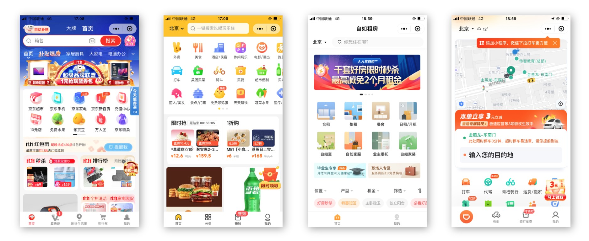

# 小程序基础

## 前言

**为什么小程序这么受欢迎？**

- 方便易用，通过扫一扫、分享等方式轻松打开小程序
- 良好的用户体验，下载速度快，小程序单个包的体积不超过 2M
- 强大的能力，提供大量硬件级别的 API，如蓝牙、WIFI 等
- 获客成本低，提供获取微信用户手机号、昵称、头像等信息的能力

**我们能学会什么？**

1. 小程序基础（day01 ~ day03）

   组件、配置、生命周期、事件处理、数据渲染、API、自定义组件、Vant UI、分包加载等

2. 小程序项目（day04~day07）

   通告管理、用户管理、房屋管理、报修管理、访客管理等各个功能模块

3. 技术和功能点：

- Vant 组件库
- 短信验证码
- Refresh Token
- 状态管理
- 地理定位
- 逆地址解析
- 地点搜索
- 路线规划
- 文件上传
- 自定义分享
- 相册访问
