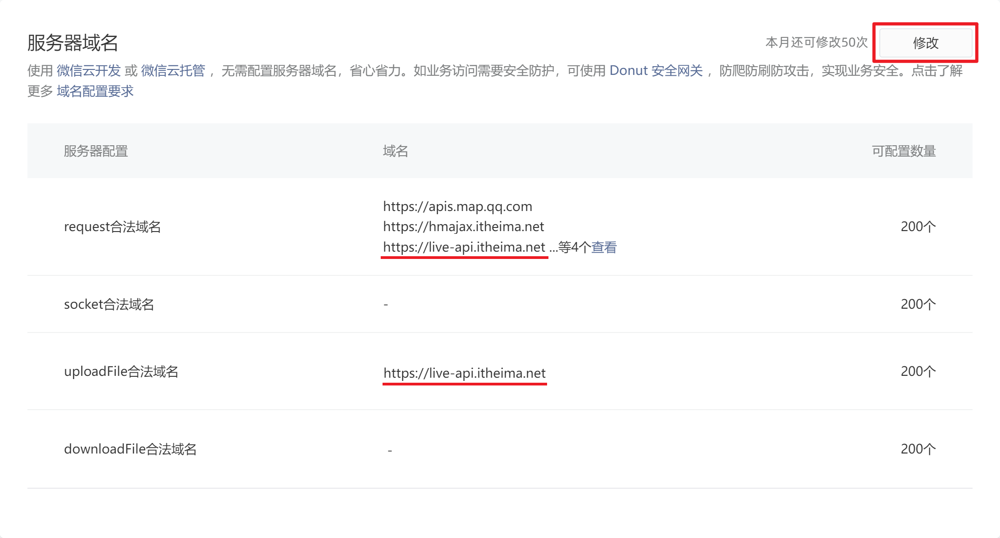

# 享+生活 - 第 1 天

## 一、团队开发准备

### 1.1 申请权限

团队开发小程序时一般不再使用个人的 AppID，而使用企业 AppID 时做为开发人员需要先申请权限，权限可以分成两种：

- 开发者权限：提供给开发者使用（程序员）

  - 提供开发者的微信号
  - 获取企业（团队）AppID

- 体验者权限：提供给测试、产品、客户等
  - 提供体验者的微信号
  - 扫码申请，由管理员审核通过

::: danger 注意

添加成员时，若搜索不到该用户。请输入正确的微信号，并确保 **“微信-我-设置-朋友权限-添加我的方式”中的“通过微信号找到我”** 选项处于打开状态。

:::

### 1.2 开发环境

小程序原始的一套开发环境比较基础，小程序项目的规模变大后将不易管理，需要有针对性的对开发环境进行调整 ，主要有 3 个方面：

**1. 优化目录结构**

将涉及业务的代码独立到单独的目录当中，非业务的文件和目录直接放在根目录中，调整后小程序运行会报错，需要修改 `project.config.json` 中的配置项：

```json
{
  "setting": {
    "packNpmManually": true,
    "packNpmRelationList": [
      {
        "miniprogramNpmDistDir": "业务代码所在目录",
        "packageJsonPath": "package.json的路径"
      }
    ]
  },
  "miniprogramRoot": "业务代码所在目录"
}
```

**2. 启用 less/sass**

通过 less/sass 可以更好的管理 css 样式，通过 `project.config.json` 可以启用对 less/sass 的支持。

```json
{
  "setting": {
    "useCompilerPlugins": ["sass"]
  }
}
```

然后将 `.wxss` 文件后缀改换成 `.scss` 即可。

**3. 配置 VS Code（可选）**

其实小程序开发者工具的代码编辑器是基于 VS Code 开发的，但小程序开发者工具对 VS Code 的插件支持不足。

因此为了提高代码编写的效率，编写小程序代码时可使用 VS Code ，调试小程序时使用小程序开发者工具。

安装用于小程序开发的一些插件：

- WXML - Language Service 小程序代码语法高亮和提示

  ```json
  {
    "minapp-vscode.wxmlFormatter": "prettier",
    "minapp-vscode.prettier": {
      "useTabs": false,
      "tabWidth": 2,
      "printWidth": 80,
      "singleQuote": false
    },
    "[wxml]": {
      "editor.defaultFormatter": "qiu8310.minapp-vscode"
    },
    "minapp-vscode.formatMaxLineCharacters": 80
  }
  ```

- Prettier - Code Formatter 格式化代码

- ... 其它

## 二、享+生活

享+社区是一个生活类的小程序项目，主要服务于小区业主，为其提供生活家电报修、访客门禁通行的的功能，该项目主要包含房屋管理、报修管理、访客管理、用户管理、通知管理等功能模块，技术栈以原生小程序技术为主配合了 [Vant 组件库](https://vant-contrib.gitee.io/vant-weapp/)。

### 2.1 启动项目

#### 2.1.1 拉取代码

享+社区小程序项目静态页面已经完成，我们的任务是联调接口处理业务逻辑，以下是代码仓库地址：

```bash
# gitee 仓库
git clone -b template https://gitee.com/lotjol/enjoy-plus.git
```

通过 `git clone` 拉取代码时默认会将远仓库地址指向了我的的仓库，会导致同学们 `push` 代码时失败，如果在企业中的情况下，需要联系负责人将你添加为团队开发者获取权限。

#### 2.1.2 运行小程序

使用小程序开发者工具导入【享+生活】的代码，注意由于我没有给大家添加开发者权限，因此不能使用我的 AppID 开发小程序，大家要换成个人 AppID！

接下来通过 VS Code 打开【享+生活】的代码，打开命令行终端安装项目的依赖：

```bash
npm install
```

最后使用小程序开发者工具构建 npm

重点注意的是 `project.config.js` 中的几个配置：

```json
{
  "miniprogramRoot": "miniprogram/",
  "setting": {
    "useCompilerPlugins": ["sass"],
    "packNpmManually": true,
    "packNpmRelationList": [
      {
        "packageJsonPath": "./package.json",
        "miniprogramNpmDistDir": "./miniprogram"
      }
    ]
  }
}
```

- `miniprogramRoot` 项目的根目录为 `miniprogram`
- `setting.useCompilerPlugins` 启用了 `sass` 支持
- `packNpmRelationList` 指定了 npm 构建时所需的 `package.json` 的位置以及构建后代码的生成位置

### 2.2 基础封装

在小程序项目的开发过程中将一些通用的功能逻辑封装成方法能够提高开发的效率。

#### 2.2.1 消息反馈

将所有通用的工具方法封装到 utils/utils.js 中：

```javascript
// utils/utils.js
const utils = {
  /**
   * 用户消息反馈
   * @param {string} title 文字提示的内容
   */
  toast(title = '数据加载失败...') {
    wx.showToast({
      title,
      mask: true,
      icon: 'none',
    })
  },
}
// 模块导出
export default utils
```

除了将封装的模块正常导出外，还可以挂载到全局对象 `wx` 上，这样在使用的时候会更方便一些。

```javascript
// 在 app.js 中导入 utils.js
import utils from './utils/utils.js'

// 挂载到全局对象 wx
wx.utils = utils

App({
  // ...
})
```

#### 2.2.2 网络请求

小程序 API [wx.request](https://developers.weixin.qq.com/miniprogram/dev/api/network/request/wx.request.html) 不支持返回 Promise、拦截器等功能，需要开发者进行二次封装。

可以使用第三方封装的 [npm 模块](https://www.npmjs.com/search?q=wechat-http)。

```bash
npm install wechat-http
```

注：安装完成后还必须要 **构建 npm** 后才可以使用。

接下来介绍 `wechat-http` 模块的使用，针对小程序端 [网络请求 API](https://developers.weixin.qq.com/miniprogram/dev/api/network/request/wx.request.html) 和 [上传文件 API](https://developers.weixin.qq.com/miniprogram/dev/api/network/upload/wx.uploadFile.html) 进行了封装，支持返回 Promise、拦截器等，其用法与 `axios` 类似：

- `http.baseURL` 配置接口基础路径
- `http.get` 以 `GET` 方法发起请求
- `http.post` 以 `POST` 方法发起请求
- `http.put` 以 `PUT` 方法发起请求
- `http.delete` 以 `DELETE` 方法发起请求
- `http.upload` 调用 [`wx.uploadFile`](https://developers.weixin.qq.com/miniprogram/dev/api/network/upload/wx.uploadFile.html) 上传文件
- `http.intercept` 配置请求和响应拦截器
- `http` 本身做为函数调用也能用于发起网络请求

新建 `utils/http.js` 文件

```javascript
// 导入 http 模块
import http from 'wechat-http'
// 基础路径，同时需添加合法请求域名
http.baseURL = 'https://live-api.itheima.net'

// 响应拦截器，返回核心数据 data
http.intercept.response = (result) => {
  return result.data
}

// 普通的模块导出
export default http
```

以全局对象方式调用时需要在入口中执行 `utils/http.js`

```javascript
// 导入 uitls/http.js
import http from './utils/http.js'

// 挂载到全局对象
wx.http = http

App({
  // ...
})
```

#### 2.2.3 配置服务器域名

【享+生活】[接口文档地址](https://www.apifox.cn/apidoc/shared-8d66c345-7a9a-4844-9a5a-1201852f6faa)

登录小程序管理后台登记 API 请求合法域名：`https://live-api.itheima.net`



### 2.3 公告管理

公告管理主要有两部的业务逻辑需要处理：一是获取公告列表，二是查看公告的详情。

#### 2.3.1 公告列表

在首页面调用接口获取公告列表数据，每次只会返回 3 条数据，不需要处理分页。

[接口文档地址](https://www.apifox.cn/apidoc/shared-8d66c345-7a9a-4844-9a5a-1201852f6faa/api-41839039)

参考代码如下所示：

```javascript
Page({
  onLoad() {
    // 获取公告列表数据
    this.getNotices()
  },
  // 调用公告列表接口
  async getNotices() {
    // 请求接口
    const { code, data: notices } = await wx.http.get('/announcement')
    // 渲染数据
    this.setData({ notices })
  },
})
```

模板中渲染数据：

```xml
<view class="notices-body">
  <navigator
    wx:for="{{notices}}"
    wx:key="id"
    hover-class="none"
    url="/pages/notify/index"
    class="notice"
  >
    <view class="notice-title">{{item.title}}</view>
    <view class="notice-brief">{{item.content}}</view>
    <view class="notice-date">{{item.createdAt}}</view>
  </navigator>
</view>
```

#### 2.3.2 公告详情

点击公告列表后将公告的 ID 通过地址参数传递到公告详情页面，在 onLoad 生命周期中读取到公告 ID，然后调用接口获取公告详情的数据。

[接口文档地址](https://apifox.com/apidoc/shared-8d66c345-7a9a-4844-9a5a-1201852f6faa/api-42249556)

参考代码如下所示：

```javascript
Page({
  data: {
    noticeDetail: {},
  },
  onLoad({ id }) {
    // 获取公告详情数据
    this.getNoticeDetail(id)
  },
  // 调用公告详情接口
  async getNoticeDetail(id) {
    // 检测 id 是否存在
    if (typeof id === undefined) return
    // 调用接接口
    const { code, data: noticeDetail } = await wx.http.get('/announcement/' + id)
    // 渲染数据
    this.setData({ noticeDetail })
  },
})
```

在模板中渲染数据：

```xml
<scroll-view enhanced show-scrollbar="{{false}}" scroll-y>
  <view class="notify-meta">
    <view class="title">{{noticeDetail.title}}</view>
    <view class="extra">
      <view class="author">{{noticeDetail.creatorName}}</view>
      <view class="datetime">{{noticeDetail.createdAt}}</view>
    </view>
  </view>
  <view class="notify-content">
    <rich-text nodes="{{noticeDetail.content}}"></rich-text>
  </view>
</scroll-view>
```

在小程序中无法直接解析富文本中包含的 HTML 标签，必须通过内置的小程序组件 `rich-text` 才能解析富文件，其用法是将富文件的内容赋值给 `nodes` 属性即可：

```xml
<!-- rich-text 使用示例 -->
<rich-text nodes="{{'<h1>这里的 h1 标签可以被小程序解析</h1>'}}"></rich-text>
```

### 2.4 用户管理

用户管理主要包含登录检测、短信验证码、登录&注册、头像和昵称的功能。

#### 2.4.1. 登录检测

在项目中大部分的页面要用户必须是登录状态才能被访问，将检测登录的逻辑封装到一个组件（authorization）当中，只要在页面中应用这个组件就能实现用户登录状态检测的功能了。

1. 在根目录中创建 `components` 文件夹用来存放全局的组件，然后通过小程序开发者工具创建一个名为 `authorization` 的组件（步骤略）

2. 接下来全局来注册这个组件，保证任何页面中都可以直接应用 `authorization` 组件：

   ```json
   {
     "usingComponents": {
       "authorization": "/components/authorization/index"
     }
   }
   ```

3. 到用户信息页面中应用 `authorization` 使用做为页面根节点

   ```xml
   <authorization>
     <view class="profile">
     	...
     </view>
   </authorization>
   ```

4. 读取本地存储的 `token` 数据，用于判断是否曾登录过

   ```javascript
   // app.js
   App({
     onLaunch() {
       // 读取本地存储的 token 数据
       this.getToken()
     },
     getToken() {
       // 将 token 数据记到应用实例中
       this.token = wx.getStorageSync('token')
     },
   })
   ```

   注：当前未实现登录的功能，因此读取到的 `token` 数据为 `undefined`

5. 检测登录状态，要求未登录时不显示页面中的内容且跳转到登录页面

   ```xml
   <!-- /components/authorization/index.wxml -->
   <slot wx:if="{{isLogin}}"></slot>
   ```

   ```javascript
   // components/auth/auth.js
   Component({
     data: {
       isLogin: false,
     },
     lifetimes: {
       attached() {
         // 获取登录凭证，判断用户是否已登录
         const app = getApp()
         // 转换成布尔类型
         const isLogin = Boolean(app.token)
         // 更新页面数据
         this.setData({ isLogin })
         // 如果未登录，跳转到登录页
         if (isLogin === false) {
           // 关闭当前页面，跳转到登录页
           wx.redirectTo({
             url: '/pages/login/index',
           })
         }
       },
     },
   })
   ```

#### 2.4.2 短信验证码

短信验证倒计时的交互使用了 Vant 的组件 `van–count-down`

- `time` 指定倒计时时长
- `bind:change` 监听时间的变化
- `use-slot` 启用插槽（自定义倒计时内容）

`van-count-down` 组件的应用示例：

```xml
<van-count-down use-slot time="{{ 60 * 1000 }}" bind:change="countDownChange">
  <text>{{timeData.seconds}}秒后重新获取</text>
</van-count-down>
```

```javascript
Page({
  // 监听时间的变化
  countDownChange(ev) {
    this.setData({
      // 倒计时当前的时间值
      timeData: ev.detail,
    })
  },
})
```

1. 结合项目来使用 `van-count-down` 组件，当用户点击了获取验证码按钮后再启用倒计时组件，通过数据 `countDownVisible` 进行控制：

   ```javascript
   Page({
     data: {
       // 初始状态不启用倒计时组件
       countDownVisible: false,
     },
     getSMSCode() {
       // 点击后启用倒计时组件
       this.set({ countDownVisible: true })
     },
   })
   ```

   ```xml
   <text bind:tap="getSMSCode" wx:if="{{!countDownVisible}}">获取验证码</text>
   <van-count-down wx:else use-slot time="{{ 60 * 1000 }}" bind:change="countDownChange">
     <text>{{timeData.seconds}}秒后重新获取</text>
   </van-count-down>
   ```

   另外还要处理倒计时结束后的状态，此时需要将倒计时组件关闭：

   ```javascript
   Page({
     countDownChange(ev) {
       this.setData({
         timeData: ev.detail,
         // 倒时结束时关闭组件
         countDownVisible: ev.detail.minutes === 1 || ev.detail.seconds > 0,
       })
     },
   })
   ```

2. 验证表单数据（手机号码）

   安装并构建[表单验证](https://www.npmjs.com/package/wechat-validate)码插件 `wechat-validate`

   ```bash
   # 安装 wechat-validate
   npm install wechat-validate
   ```

   将插件导入到项目中：

   - `behaviors` 将插件注入到页面中
   - `rules` 由插件提供的属性，用来定义数据验证的规则（类似于 Element UI）
   - `validate` 由插件提供的方法，根据 `rules` 的规则来对数据进行验证

   ```javascript
   // 导入表单验证插件
   import wxValidate from 'wechat-validate'
   Page({
     data: {
       mobile: '',
     },
     // 将插件注入到页面实例中
     behaviors: [wxValidate],
     rules: {
       mobile: [
         { required: true, message: '请填写手机号码!' },
         { pattern: /^1[3-8]\d{9}$/, message: '请填写正确的手机号码!' },
       ],
     },
     // 获取短信验证码
     async getSMSCode() {
       // 获取验证结果
       const { valid, message } = this.validate('mobile')
       // 如果验证不合法则不再执行后面的逻辑
       if (!valid) return wx.utils.toast(message)
       // 显示倒计时组件
       this.setData({ countDownVisible: true })
     },
   })
   ```

   用户填写的手机号 `mobile` 通过简易双向数据绑定来获取：

   ```xml
   <van-field maxlength="{{ 11 }}" model:value="{{mobile}}" />
   ```

3. 调用接口将手机号发送给服务端

   [接口文档地址](https://apifox.com/apidoc/shared-8d66c345-7a9a-4844-9a5a-1201852f6faa/api-42672274)

   参考代码如下所示：

   ```javascript
   Page({
     // 获取短信验证码
     async getSMSCode() {
       // 获取验证结果
       const { valid, message } = this.validate('mobile')
       // 如果验证不合法则不再执行后面的逻辑
       if (!valid) return wx.utils.toast(message)
       // 显示倒计时组件
       this.setData({ countDownVisible: true })
       // 调用接口获取验证码
       const { code, data } = await wx.http.get('/code', { mobile: this.data.mobile })
       // 检测验证码是否发送成功
       if (code !== 10000) return wx.utils.toast('发送失败，稍后重试!')
     },
   })
   ```

   注：在生产环境中短信验证码不会通过接口返回，只能以短信的形式发送到用户的手机上，在课程中的发开发环境可以通过接口获取短信验证码。

#### 2.4.3 登录&注册

调用接口把获取的手机号码和验证码发送给服务端，登录和注册功能是合二为一的，后端会检测手机号是否已注册过，如果注册了则执行登录的操作，否则执行注册的操作。

[接口文档地址](https://apifox.com/apidoc/shared-8d66c345-7a9a-4844-9a5a-1201852f6faa/api-42672276)

1. 在调用接口前需要对验证码的数据进行验证码：

   ```xml
   <van-field model:value="{{code}}" />
   ```

   ```javascript
   Page({
     data: {
       mobile: '',
       code: '',
     },
     rules: {
       // ...
       code: [
         { required: true, message: '请填写验证码!' },
         { pattern: /^\d{6}$/, message: '请填写正确的验证码!' },
       ],
     },
   })
   ```

   监听用户点击登录按钮，然后调用接口：

   ```javascript
   Page({
     // ...
     // 提交表单数据，完成登录/注册的功能
     async submitForm() {
       // 验证数据是否合法
       if (!this.validate()) return
       // 调用登录接口
       const { code, data } = await wx.http.post('/login', {
         mobile: this.data.mobile,
         code: this.data.code,
       })
       // 验证是否登录成功
       if (code !== 10000) return wx.utils.toast('登录失败，稍后重试!')
     },
   })
   ```

2. 记录登录状态，将 `token` 存入本地存储

   ```javascript
   // app.js
   App({
     // ...
     setToken(key, token) {
       // 将 token 记录在应用实例中
       this[key] = token
       // 将 token 存入本地
       wx.setStorageSync(key, token)
     },
   })
   ```

   ```javascript
   // pages/login/index.js
   const app = getApp()
   Page({
     // ...
     // 提交表单数据，完成登录/注册的功能
     async submitForm() {
       // 验证数据是否合法
       if (!this.validate()) return
       // 调用登录接口
       const { code, data } = await wx.http.post('/login', {
         mobile: this.data.mobile,
         code: this.data.code,
       })
       // 验证是否登录成功
       if (code !== 10000) return wx.utils.toast('登录失败，稍后重试!')
       // 记录登录状态
       app.setToken('token', data.token)
       app.setToken('refreshToken', data.refreshToken)
     },
   })
   ```

3. 地址重定向，登录成功后跳回到原来的页面

   在 `authoirzation` 组件检测登录时获取当前页面栈实例，并在跳转到登录页面时在 URL 地址上拼凑参数：

   ```javascript
   // /components/authorization/index.js
   Component({
     // ...
     lifetimes: {
       attached() {
         // 获取登录状态
         const isLogin = !!getApp().token
         // 变更登录状态
         this.setData({ isLogin })
         // 获取页面栈
         const pageStack = getCurrentPages()
         // 获取页面路径
         const currentPage = pageStack.pop()
         // 未登录的情况下跳转到登录页面
         if (!isLogin) {
           wx.redirectTo({
             url: '/pages/login/index?redirectURL=/' + currentPage.route,
           })
         }
       },
     },
   })
   ```

   在登录成功后获取地址的参数（一个页面的路径），重定向到原来的页面

   ```javascript
   // pages/login/index.js
   const app = getApp()
   Page({
     // ...
     onLoad({ redirectURL }) {
       // 获取地址参数
       this.redirectURL = redirectURL
     },
     // 提交表单数据，完成登录/注册的功能
     async submitForm() {
       // 验证数据是否合法
       if (!this.validate()) return
       // 调用登录接口
       const { code, data } = await wx.http.post('/login', {
         mobile: this.data.mobile,
         code: this.data.code,
       })
       // 验证是否登录成功
       if (code !== 10000) return wx.utils.toast('登录失败，稍后重试!')
       // 记录登录状态
       app.setToken('token', data.token)
       app.setToken('refreshToken', data.refreshToken)
       // 重定向
       wx.redirectTo({ url: this.redirectURL })
     },
   })
   ```

#### 2.4.4 头像和昵称

配置请求拦截器将用户的登录状态通过自定义的头信息 `Authorization` 随接口调用时一起发送到服务端。

```javascript
// utils/http.js
// 导入 wechat-http 模块
import http from 'wechat-http'
// 配置接口基础路径
http.baseURL = 'https://live-api.itheima.net'
// 配置请求拦截器
http.intercept.request = function (options) {
  // 扩展头信息
  const defaultHeader = {}
  // 身份认证
  defaultHeader.Authorization = 'Bearer ' + getApp().token
  // 与默认头信息合并
  options.header = Object.assign({}, defaultHeader, options.header)
  // 处理后的请求参数
  return options
}
// ...
```

注：传递 `token` 时需要拼凑字符串前缀 "Bearer "

1. 获取用户信息

   调用接口获取当前用户的信息，此时还是一个新用户，所以用户昵称和头像数据都是不存在。

   [接口文档地址](https://apifox.com/apidoc/shared-8d66c345-7a9a-4844-9a5a-1201852f6faa/api-42037729)

   参考示例代码：

   ```javascript
   // 获取应用实例
   const app = getApp()
   Page({
     onLoad() {
       // 用户未登录时不必请求
       app.token && this.getUserProfile()
     },
     async getUserProfile() {
       // 调用接口获取昵称和头像
       const {
         code,
         data: { avatar, nickName },
       } = await wx.http.get('/userInfo')
       // 检测接口是否正常返回结果
       if (code !== 10000) return wx.utils.toast()
       // 渲染数据
       this.setData({ avatar, nickName })
     },
   })
   ```

   渲染接口返回的数据：

   ```xml
   <view class="profile">
   	<view class="profile-base">
       <image class="avatar" src="{{avatar}}"></image>
       <text class="nickname">{{nickName || '微信用户'}}</text>
       <navigator hover-class="none" class="link" url="/pages/profile/index">
         去完善信息<text class="enjoy-icon icon-arrow"></text>
       </navigator>
     </view>
     ...
   </view>
   ```

2. 更新用户昵称

   [接口文档地址](https://apifox.com/apidoc/shared-8d66c345-7a9a-4844-9a5a-1201852f6faa/api-42037730)

   获取用户填写的昵称后调用接口提交数据：

   ```xml
   <!-- pages/profile/index.wxml -->
   <!-- 需要检测登录状态 -->
   <authorization>
     <view class="profile">
       ...
       <van-field
         center
         label="昵称"
         input-align="right"
         bind:blur="getUserNickname"
         type="nickname"
         value="{{nickName}}"
         placeholder="请输入昵称"
       />
     </view>
   </authorization>

   ```

   ```javascript
   // pages/profile/index.js
   Page({
     // 获取用户昵称
     getUserNickname(ev) {
       // 更新昵称
       this.updateNickname(ev.detail.value)
     },
     // 更新昵称接口
     async updateNickname(nickName) {
       if (nickName === '') return
       // 调用接口更新用户昵称
       const { code } = await wx.http.put('/userInfo', { nickName })
       // 检测接口是否调用成功
       if (code !== 10000) return wx.utils.toast('更新昵称失败!')
     },
   })
   ```

   在此可以通过页面实例来更新 `pages/my/index.wxml` 的昵称：

   ```javascript
   // pages/profile/index.js
   const pageStack = getCurrentPages()
   Page({
     // 获取用户昵称
     getUserNickname(ev) {
       // 更新昵称
       this.updateNickname(ev.detail.value)
     },
     // 更新昵称接口
     async updateNickname(nickName) {
       if (nickName === '') return
       // 调用接口更新用户昵称
       const { code } = await wx.http.put('/userInfo', { nickName })
       // 检测接口是否调用成功
       if (code !== 10000) return wx.utils.toast('更新昵称失败!')
       // 借助于页面栈实例来更新 pages/my/index.wxml 中的昵称
       pageStack[0].setData({ nickName })
     },
   })
   ```

3. 更新用户头像

   [接口文档地址](https://apifox.com/apidoc/shared-8d66c345-7a9a-4844-9a5a-1201852f6faa/api-42672275)

   获取用户选择的头像地址，通过 `wx.uploadFile` 将图片上传到服务端，`wx.uploadFile` 的基本语法：

   - `url` 上传接口地址
   - `filePath` 待上传文件的临时路径（该路径只能用于小程序内部）
   - `name` 接口接收上传文件的数据名称（由后端指定）
   - `formData` 除上传文件外的其它数据
   - `header` 自定义头信息
   - `success` 上传成功的回调函数
   - `fail` 上传失败后的回调函数
   - `complete` 上传完成时的回调（无论成功或失败）

   注：该 API 不支持返回 Promise，调用该 API 时，需要提前在小程序管理后台添加服务器域名。

   参考示例代码如下所示：

   ```xml
   <!-- pages/profile/index.wxml -->
   <authorization>
     <view class="profile">
       <van-cell center title="头像">
         <van-icon slot="right-icon" name="arrow" size="16" color="#c3c3c5" />
         <button
           class="button"
           size="mini"
           hover-class="none"
           bind:chooseavatar="getUserAvatar"
           open-type="chooseAvatar">
           <image class="avatar" src="{{avatar}}"></image>
         </button>
       </van-cell>
       ...
     </view>
   </authorization>
   ```

   ```javascript
   // pages/profile/index.js
   const pageStack = getCurrentPages()
   Page({
     // 获取用户头像
     getUserAvatar(ev) {
       // 更新用户头像
       this.updateAvatar(ev.detail.avatarUrl)
     },
     // 更新用户头像
     updateAvatar(avatar) {
       // 调用 API 上传文件
       wx.uploadFile({
         // 接口地址
         url: wx.http.baseURL + '/upload',
         // 待上传的文件路径
         filePath: avatar,
         name: 'file',
         header: {
           // 用户登录状态
           Authorization: 'Bearer ' + getApp().token,
         },
         formData: { type: 'avatar' },
         success: (result) => {
           // 处理返回的数据
           const data = JSON.parse(result.data)
           // 检测接口是否调用成功
           if (data.code !== 10000) return wx.utils.toast('上传头像失败!')
           // 借助于页面栈实例来更新 pages/my/index.wxml 中的头像
           pageStack[0].setData({ avatar: data.data.url })
         },
       })
     },
   })
   ```

   上述代码中通过 `wx.http.baseURL` 获取接口服务器地址，通过应用实例获取 `token`。

4. 默认头像和昵称

   通过应用实例来跨页面共享数据，将在 `pages/my/index.wxml` 获取的数据存入应用实例中：

   ```javascript
   // pages/my/index.js
   Page({
     // ...
     async getUserProfile() {
       // ...
       // 将头像和昵称存到应用实例中
       app.userProfile = { avatar, nickName }
     },
   })
   ```

   在 `pages/profile/index.wxml` 中读取应用实例中的数据

   ```javascript
   // pages/profile/index.js
   Page({
     onLoad() {
       // 获取实例
       const app = getApp()
       // 将头像和昵称渲染到页面中
       this.setData({ ...app.userProfile })
     },
     // ...
     async updateNickname(nickName) {
       // ...
       // 同步数据到应用实例中
       const app = getApp()
       app.userProfile.nickName = nickName
     },
     // ...
     updateAvatar(avatar) {
       // ...
       // 同步更新数据到应用实例中
       const app = getApp()
       app.userProfile.avatar = data.data.url
     },
   })
   ```

   在更新头像和昵称后记得将最新的数据同步到应用实例中。
