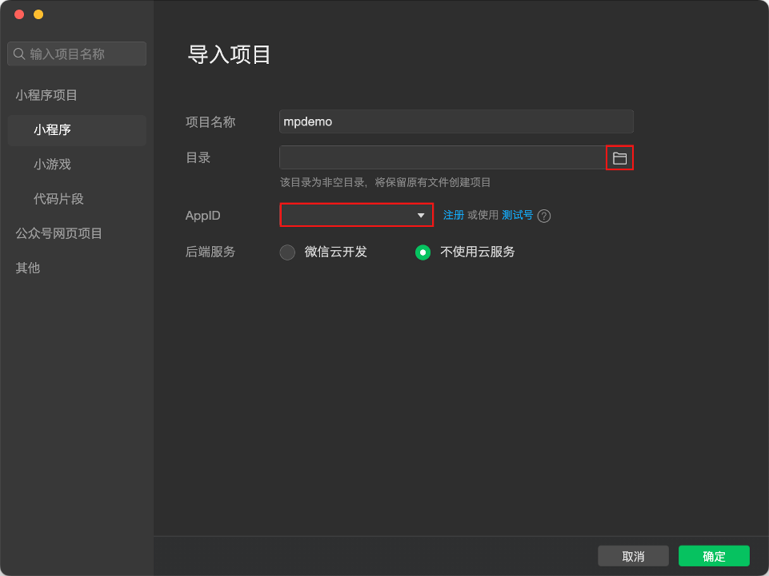
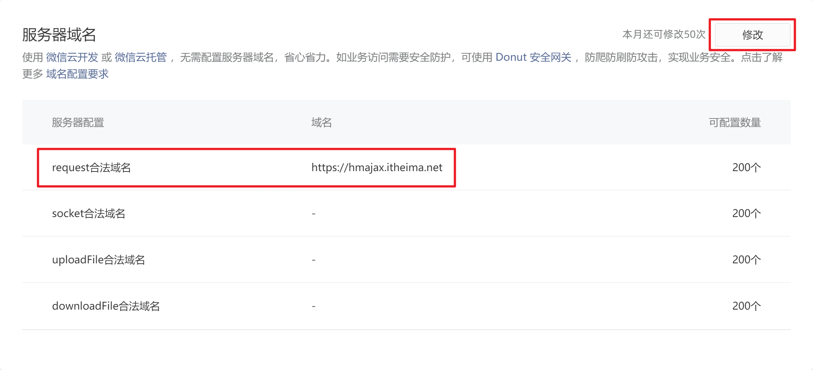
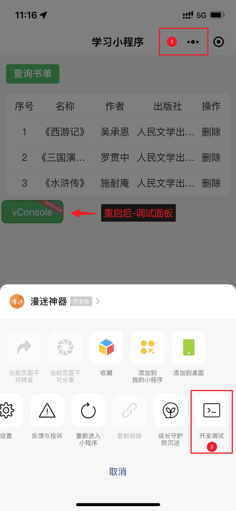
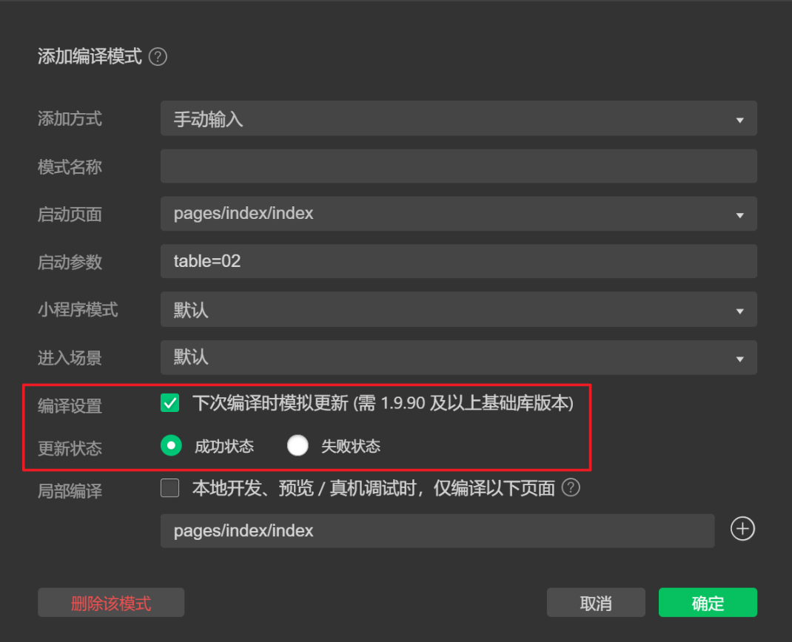

# 微信小程序开发 - 第 2 天

## 一、导入小程序



- 选择代码目录

- 项目配置文件

  - `appid` 当前小程序的 AppID
  - `projectname` 当前小程序的项目名称

- 变更 AppID（视情况而定，如果没有开发权限时需要变更成个人的 AppID）

## 二、模板语法

在页面中渲染数据时所用到的一系列语法叫做模板语法，对应到 Vue 中就是指令的概念。

### 2.1 数据绑定

- 双花括号插值

  小程序中使用双花括号实现数据与模板的绑定，与 Vue 中不同的是**无论是内容绑定还是属性绑定**都使用双花括号。

  ```xml
  <!-- 内容绑定 -->
  <view>{{ 1 + 1 }}</view>
  <!-- 属性绑定 -->
  <switch checked="{{ false }}" />
  <!-- 此处是字符串的 "false"，最终导致 Boolean("false") 布尔结果为 true -->
  <switch checked="false" />
  <!-- 此处是 false + " "，最终导致 Boolean("false ") 布尔结果为 true -->
  <switch checked="{{ false }} " />
  ```

::: warning 注意

属性绑定时**花括号与引号之间不留多余空格**，多余空格会被解析为字符串。

:::

- 简易数据绑定

  小程序中提供了 `model:value="{{ 数据名 }}"` 语法来实现双向的数据绑定，但是目前只能用在 `input` 和 `textarea` 组件中。

本节中用到的演示代码如下：

```xml
<!-- 数据绑定 -->
<view class="binding">
  <!-- 开关组件 -->
  <switch checked="{{ isOpen }}"/>
  <!-- 双向数据绑定 -->
  <input type="text" model:value="{{ message }}" />
  <view class="message">{{ message }}</view>
</view>
```

```javascript
Page({
  data: {
    isOpen: true,
    message: 'hello world!',
  },
})
```

::: warning 注意

简易双向绑定暂不支持 `对象.属性` 写法。

```vue
<!-- 🚨 常见错误：暂不支持以下写法 -->
<input model:value="{{ form.username }}" />
```

:::

### 2.2 条件渲染

- 控制属性：相当于 Vue 中指令的概念，在小程序中做控制属性
  - `wx:if` 根据表达式的值渲染内容，值为真时显示
  - `wx:else` 用在 `wx:else` 的后面，不可单独使用，`wx:if` 表达式值为假时显示
- 组件属性：
  - hidden 根据表达式的值渲染内容，值为真时隐藏
  - 通过 `[hidden] { display: none; }` 来实现内容的隐藏

本节中用到的演示代码如下：

```xml
<!-- 条件渲染 wx:if 和 wx:else -->
<view class="welcome">
  <text wx:if="{{ isLogin }}">大师兄</text>
  <text wx:else>游客</text>你好:
</view>

<!-- 条件渲染 hidden -->
<view class="loading">
  <!-- 可以单独使用 -->
  <!-- <text wx:if="{{ !loaded }}">正在加载...</text> -->
  <text hidden="{{ loaded }}">正在加载...</text>
</view>
```

```javascript
Page({
  data: {
    isOpen: true,
    message: 'hello world!',
    isLogin: true,
    loaded: false,
  },
})
```

### 2.3 列表渲染

- `wx:for` 根据数组重复渲染组件内容
  - `index` 默认值，访问数组的索引值
  - `item` 默认值，访问数组的单元值
- `wx:key` 列表项的唯一标识符（不使用 {{}}）
  - 数组单元是对象时，只需要写属性名
  - 数组单元是简单类型时，推荐使用 `*this`
- `wx:for-index` 自定义访问数组索引的变量名
- `wx:for-item` 自定义访问数组单元的变量名

本节中用到的演示代码如下：

```xml
<!-- 列表渲染 -->
<view class="students">
  <view class="item">
    <text>序号</text>
    <text>姓名</text>
    <text>年龄</text>
    <text>性别</text>
    <text>级别</text>
  </view>
  <view class="item">
    <text>1</text>
    <text>贺洋</text>
    <text>20</text>
    <text>男</text>
    <text>菜鸟</text>
  </view>
</view>
<!-- 简单数组 -->
<view class="history">
  <text>小米</text>
</view>
```

```javascript
Page({
  data: {
    isOpen: true,
    message: 'hello world!',
    isLogin: true,
    loaded: false,
    students: [
      { id: 1, name: '贺洋', age: 20, gender: '男', level: '菜鸟' },
      { id: 2, name: '唐刚', age: 18, gender: '女', level: '笨鸟' },
      { id: 3, name: '常超', age: 20, gender: '女', level: '老鸟' },
    ],
    history: ['苹果', '华为', 'OPPO', '三星'],
  },
})
```

参考样式

```css
/* pages/index/index.wxss */
.binding {
  padding: 30rpx 20rpx;
  border-radius: 10rpx;
  background-color: #fff;
}

.binding .message {
  height: 44rpx;
  padding-left: 20rpx;
  margin-top: 20rpx;
}

.binding switch {
  margin-bottom: 20rpx;
}

.welcome,
.loading {
  height: 44rpx;
  padding: 20rpx;
  margin-top: 20rpx;
  border-radius: 10rpx;
  background-color: #fff;
}

.students {
  padding: 0 20rpx;
  margin-top: 20rpx;
  border-radius: 10rpx;
  background-color: #fff;
}

.students .item {
  display: flex;
  justify-content: space-between;
  height: 44rpx;
  padding: 20rpx 0;
  border-bottom: 1rpx solid #eee;
}

.students .item:last-child {
  border: none;
}

.students .item text {
  flex: 1;
  text-align: center;
}

.history {
  margin-top: 20rpx;
  padding: 30rpx 20rpx;
  border-radius: 10rpx;
  background-color: #fff;
}

.history text {
  margin-right: 20rpx;
  margin-top: 20rpx;
  padding: 8rpx 28rpx;
  border-radius: 50rpx;
  background-color: #f7f6f7;
  font-size: 28rpx;
}
```

## 三、内置 API

内置 API 实际上就是小程序提供的一系列的方法，这些方法都封装在了全局对象 `wx` 下，调用这些方法实现小程序提供的各种功能，如网络请求、本地存储、拍照、录音等。

### 3.1 网络请求

调用 `wx.request` 能够在小程序中发起网络请求与后端接口进行数据的交互，其语法格式如下：

```javascript
wx.request({
  url: '这里是接口的地址',
  method: '这里是请求的方法',
  data: '请求时提交的数据',
  header: {
    /* 请求头信息 */
  },
  success: () => {
    /* 成功的回调 */
  },
  fail: () => {
    /* 失败的回调 */
  },
  complete: () => {
    /* 成功或失败的回调 */
  },
})
```

本节中用到的演示代码如下：

```xml
<button class="button" size="mini" type="primary">查询书单</button>
<view class="books">
  <view class="item">
    <text>序号</text>
    <text>名称</text>
    <text>作者</text>
    <text>出版社</text>
    <text>操作</text>
  </view>
  <view class="item">
    <text>1</text>
    <text>西游记</text>
    <text>吴承恩</text>
    <text>人民文学出版社</text>
    <text>删除</text>
  </view>
</view>
```

```javascript
Page({
  data: {
    books: [],
  },
  // 调用数据接口的方法
  getBooks() {
    // 调用小程序的 API 发起请求
    wx.request({
      url: 'https://hmajax.itheima.net/api/books',
      method: 'GET',
      data: {
        creator: 'zhangsan',
      },
      success: (result) => {
        // 更新数据，渲染页面
        this.setData({ books: result.data.data })
      },
    })
  },
})
```

#### 配置服务器域名

登录小程序管理后台登记 API 请求合法域名：`https://hmajax.itheima.net`



#### 真机预览/调试

手机端如果出现白屏，需要开启开发模式才能正常预览。



### 3.2 界面交互

- `wx.showLoading` 显示 loading 提示框

  - `title` 文字提示内容

  - `mask` 是否显示透明蒙层，防止触摸穿透

- `wx.hideLoading` 隐藏 loading 提示框

- `wx.showToast` 消息提示框（轻提示）

  - `mask` 是否显示透明蒙层，防止触摸穿透
  - `duration` 延迟时间（提示框显示多久）
  - `icon` 指定图标，`none` 不使用图标

### 3.3 本地存储

- `wx.setStorageSync` 存入一个数据，复杂类型数据不需要 `JSON.stringify` 处理
- `wx.getStorageSync` 读取一个数据，复杂类型数据不需要 `JSON.parse` 处理
- `wx.removeStorageSync` 删除一个数据
- `wx.clearStorageSync` 清空全部数据

本节中用到的演示代码如下：

```xml
<!-- 本地存储 -->
<view class="storage">
  <button size="mini" type="primary">存数据</button>
  <button size="mini" type="primary">读数据</button>
  <button size="mini" type="primary">删数据</button>
  <button size="mini" type="primary">清数据</button>
</view>
```

### 3.4 API 特征

小程序中提供的 API 数量相当的庞大，很难也没有必要将所有的 API 全部掌握，但是这些 API 具有一些共有的特征：

- 异步 API：绝大部分的 API 都是异步方式，通过回调函数获取 API 执行的结果
  - `success` API 调用成功时执行的回调
  - `fail` API 调用失败时执行的回调
  - `complete` API 调用结束时执行的回调（无论成功或失败）
- 同步 API：部分 API 支持以同步方式获取结果，这些 API 的名称都以 `Sync` 结尾，如 `wx.getStorageSync` 等
- Promise：部分异步的 API 也支持以 Promise 方式返回结果，此时可以配合 `asyc/await` 来使用

### 3.5 相册/拍照

`wx.chooseMedia` 调起摄像头拍照或读取相册内容，该 API 既支持回调方式获取结果，也支持 Promise 方式返回结果：

```jsx
;<view class="preview" bind:tap="onChoose">
  <image src="{{ avatar }}" mode="aspectFill" />
</view>

Page({
  // 用于页面渲染的数据
  data: {
    avatar: '',
  },
  // 选择图片
  async onChoose() {
    // 推荐使用 async await 的写法，减少不必要的回调地狱
    const res = await wx.chooseMedia({
      mediaType: ['image'],
      count: 1,
    })
    this.setData({
      avatar: res.tempFiles[0].tempFilePath,
    })
  },
})
```

### 3.6 小练习

本节搜索历史练习用到的演示代码如下：

1. 点击搜索按钮
   - 非空判断
   - 新增历史记录，需数组去重
   - 清空搜索框
2. 删除搜索历史，无搜索历史，不渲染历史搜索的标题

```xml
<!-- 搜索历史 -->
<view class="history">
  <view class="search-bar">
    <input type="text" />
    <text class="label">搜索</text>
  </view>
  <view class="title">
    历史搜索 <text class="icon-delete">x</text>
  </view>
  <view class="keywords">
    <navigator url="/pages/test/index">小米</navigator>
    <navigator url="/pages/test/index">苹果</navigator>
    <navigator url="/pages/test/index">华为</navigator>
  </view>
</view>
```

## 四、事件处理

### 4.1 事件对象

前面已经介绍过小程序事件监听的语法：`bind:事件类型=事件回调`，但是小程序的事件回调不支持传参数，因此要将模板中的数据传递到事件回调中就必须要通过事件对象来实现。

小程序事件回调函数的第 1 个参数即为事件对象，事件对象中包括了一些有用的信息：

```javascript
Page({
  eventHandler(ev) {
    // 查看事件对象
    console.log(ev)
  },
})
```

本节练习用到的演示代码如下：

```xml
<!-- 搜索框 -->
<view class="search-bar">
  <input type="text" placeholder="输入搜索关键字" />
</view>
<!-- 页面主体 -->
<view class="page-body">
  <view class="aside">
    <view class="item"></view>
    <view class="item"></view>
  </view>
  <view  class="content">
    <view class="item"></view>
    <view class="item"></view>
  </view>
</view>

```

### 4.2 组件事件

前面介绍的 `tap` 事件可以在绝大部分组件是监听，我们可以将其理解为通用事件类型，然而也有事件类型只属于某个组件，我们将其称为组件事件。

**`scroll-view` 组件中的事件：**

- `bind:scrolltolower` 当滚动内容到达底部或最右侧时触发
- `refresher-enable` 启用自定义下拉刷新
- `bind:refresherrefresh` 执行下拉操作时触发

本节练习用到的演示代码如下：

```javascript
Page({
  data: {
    isPulling: false,
  },
  onScrollPulling() {
    // 请求最新的数据
    wx.request({
      url: 'https://hmajax.itheima.net/api/books',
      data: { creator: 'zhangsan' },
      success: (result) => {},
      complete: () => {
        // 停止下拉刷新
        this.setData({ isPulling: false })
      },
    })
  },
})
```

**表单组件中的事件：**

- `change` 表单数据发生改变时触发，事件对象中收集数据
- `input` 和 `textarea` 用双向绑定，底层通过 `bind:input` 和 `value` 实现
- `submit` 表单提交时触发，`button` 按钮必须指定 `form-type` 属性

本节练习用到的演示代码如下：

```xml
<!-- 用户信息 -->
<view class="register">
  <form>
    <view class="form-field">
      <label for="">姓名:</label>
      <view class="field">
        <input type="text" placeholder="请输入您的姓名" />
      </view>
    </view>
    <button size="mini" type="primary">保存</button>
  </form>
</view>
```

## 五、生命周期

生命周期是一些名称固定自动执行的函数。

### 5.1 页面生命周期

- `onLoad` 在页面加载完成时执行，只会执行 1 次，常用于获取地址参数和网络请求
- `onShow` 在页面处于可见状态时执行，常用于动态更新数据或状态
- `onReady` 在页面初次渲染完成时执行，只会执行 1 次，常用于节点操作或动画交互等场景
- `onHide` 在页面处于不见状态时执行，常用于销毁长时间运行的任务，如定时器

### 5.2 应用生命周期

- `onLaunch` 小程序启动时执行 1 次，常用于[小程序更新](https://developers.weixin.qq.com/miniprogram/dev/api/base/update/UpdateManager.html#示例代码)，获取[启动参数](https://developers.weixin.qq.com/miniprogram/dev/api/base/app/life-cycle/wx.getLaunchOptionsSync.html)，获取[场景值](https://developers.weixin.qq.com/miniprogram/dev/reference/scene-list.html)
- `onShow` 小程序前台运行时执行
- `onHide` 小程序后台运行时执地

本节练习用到的演示代码如下：

```javascript
// app.js
App({
  onLaunch() {
    // 小程序启动时，检查更新
    this.checkUpdate()
  },
  checkUpdate() {
    // 获取版本更新管理器
    const updateManager = wx.getUpdateManager()

    // 检查更新结果
    updateManager.onCheckForUpdate(function (res) {
      // 是否有更新
      console.log(res.hasUpdate)
    })

    // 监听小程序有版本更新事件
    updateManager.onUpdateReady(function () {
      // 客户端主动触发下载（无需开发者触发下载，只需要做引导重启的提示即可）
      wx.showModal({
        title: '更新提示',
        content: '新版本已经准备好，是否重启应用？',
        success: function (res) {
          if (res.confirm) {
            // 新的版本已经下载好，调用 applyUpdate 应用新版本并重启
            updateManager.applyUpdate()
          }
        },
      })
    })
  },
})
```

::: tip 温馨提示

微信开发者工具上可以通过「编译模式」下的「下次编译模拟更新」开关来调试**模拟更新**。

:::


