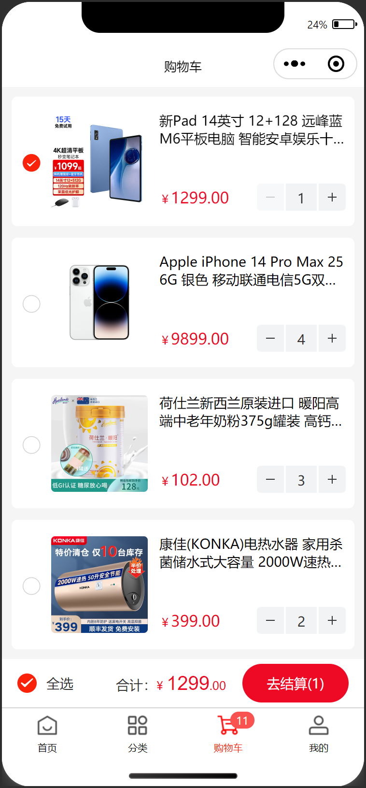
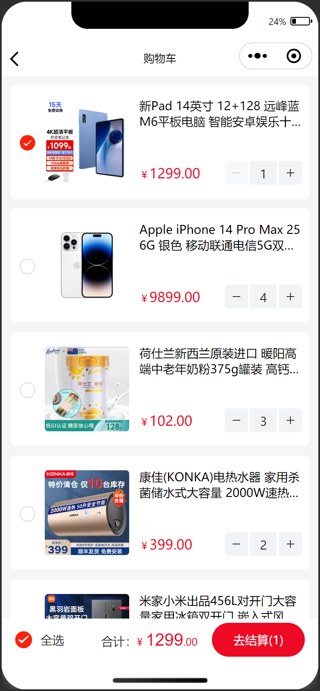
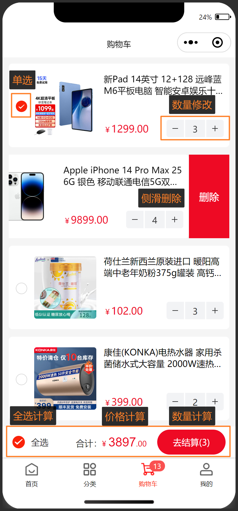

# 购物车

## 任务目标

1. 共有两个购物车页面，tabBar 页和 普通页(从商品详情跳转)，抽离成组件后复用
2. 获取登录用户购物车列表数据并渲染
3. 实现购物车商品的数量修改
4. 实现购物车商品的滑动删除
5. 实现购物车中选中商品数量和价格计算
6. 实现购物车商品全选和取消全选

[参考效果](https://smart-shop.itheima.net/#/pages/cart/index)

<!--  -->

<table style="text-align:center;">
  <tr>
    <td>
      tabBar页 购物车
    </td>
    <td>
      普通页 购物车
    </td>
  </tr>
  <tr>
    <td>
      
    </td>
    <td>
      
    </td>
  </tr>
  <tr>
    <td>
      页面交互
    </td>
    <td>
      空状态
    </td>
  </tr>
  <tr>
    <td>
      
    </td>
    <td>
      
    </td>
  </tr>
</table>

## 资料速查

**布局**

- [flex 布局](https://developer.mozilla.org/zh-CN/docs/Web/CSS/CSS_flexible_box_layout/Basic_concepts_of_flexbox)
- [CSS 变量](https://developer.mozilla.org/zh-CN/docs/Web/CSS/Using_CSS_custom_properties)
- [van-swipe-cell 滑动单元格](https://vant-contrib.gitee.io/vant-weapp/#/swipe-cell)
- [van-stepper 步进器](https://vant-contrib.gitee.io/vant-weapp/#/stepper)
- [van-empty 空状态](https://vant-contrib.gitee.io/vant-weapp/#/empty)
- [van-checkbox 复选框](https://vant-contrib.gitee.io/vant-weapp/#/checkbox)
- [van-submit-bar 提交订单栏](https://vant-contrib.gitee.io/vant-weapp/#/submit-bar)

**逻辑**

- [为 tabBar 某一项的右上角添加文本](https://developers.weixin.qq.com/miniprogram/dev/api/ui/tab-bar/wx.setTabBarBadge.html)
- [网络请求 - wechat-http](https://www.npmjs.com/package/wechat-http)
- [接口文档-获取购物车商品列表](https://apifox.com/apidoc/shared-dead2bca-2509-43dc-a4de-ede5218058a1/api-97252193)
- [接口文档-更新购物车商品](https://apifox.com/apidoc/shared-dead2bca-2509-43dc-a4de-ede5218058a1/api-97252194)
- [接口文档-删除购物车商品](https://apifox.com/apidoc/shared-dead2bca-2509-43dc-a4de-ede5218058a1/api-97252195)
- [接口文档-获取购物车商品总数量](https://apifox.com/apidoc/shared-dead2bca-2509-43dc-a4de-ede5218058a1/api-97252184)
