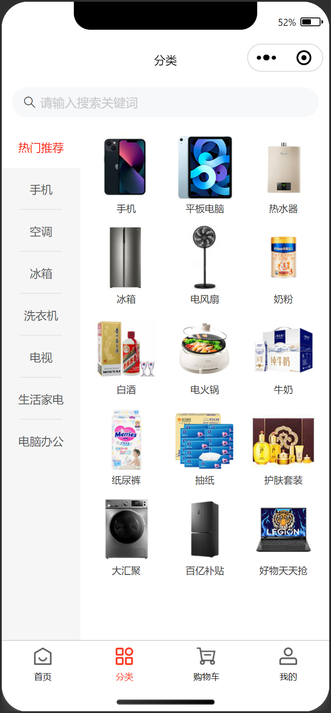

# 分类

## 任务目标

1. 完成分类页布局
2. 完成数据请求和渲染
3. 实现切换分类交互效果
4. 完成首页和分类页的搜索组件封装（注意和首页伙伴协调分工）

[参考效果](https://smart-shop.itheima.net/#/pages/category/index)

<!-- ## 实现细节

1. 获取分类列表总数据，按需提取出左侧列表数据和右侧列表数据，渲染到页面中
2. 实现一级分类高亮和切换效果，点击一级分类右侧显示对应二级分类 -->

<!--  -->

<table style="text-align:center;">
  <tr>
    <td>
      默认状态
    </td>
    <td>
      交互切换
    </td>
  </tr>
  <tr>
    <td>
      
    </td>
    <td>
      
    </td>
  </tr>
</table>

## 资料速查

**布局**

- [flex 布局](https://developer.mozilla.org/zh-CN/docs/Web/CSS/CSS_flexible_box_layout/Basic_concepts_of_flexbox)
- [CSS 变量](https://developer.mozilla.org/zh-CN/docs/Web/CSS/Using_CSS_custom_properties)
- [scroll-view 可滚动视图区域](https://developers.weixin.qq.com/miniprogram/dev/component/scroll-view.html)

**组件封装**

- [指南 - 自定义组件](https://developers.weixin.qq.com/miniprogram/dev/framework/custom-component/)
- [框架 - Component](https://developers.weixin.qq.com/miniprogram/dev/reference/api/Component.html)

**逻辑**

- [mark 事件传参](https://developers.weixin.qq.com/miniprogram/dev/framework/view/wxml/event.html#mark)
- [网络请求 - wechat-http](https://www.npmjs.com/package/wechat-http)
- [接口文档](https://apifox.com/apidoc/shared-dead2bca-2509-43dc-a4de-ede5218058a1/api-97252206)
