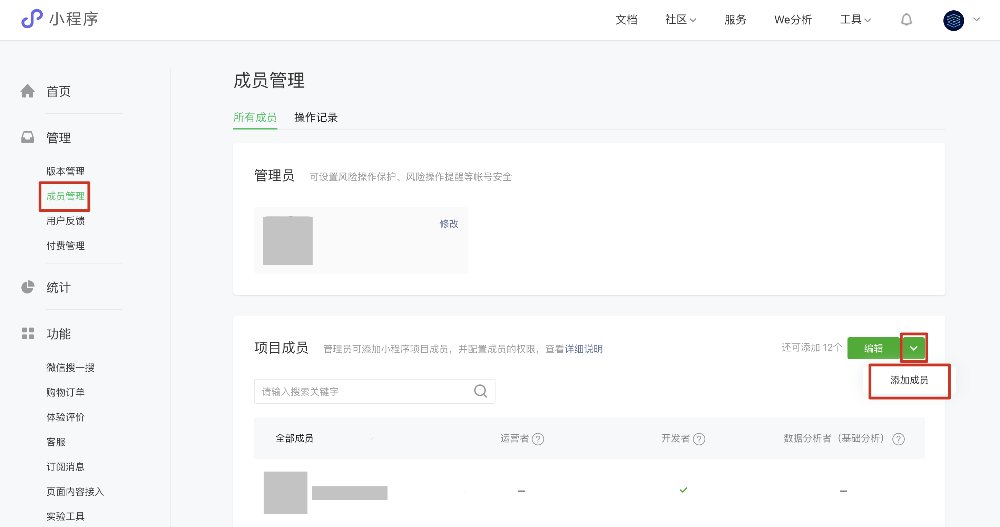
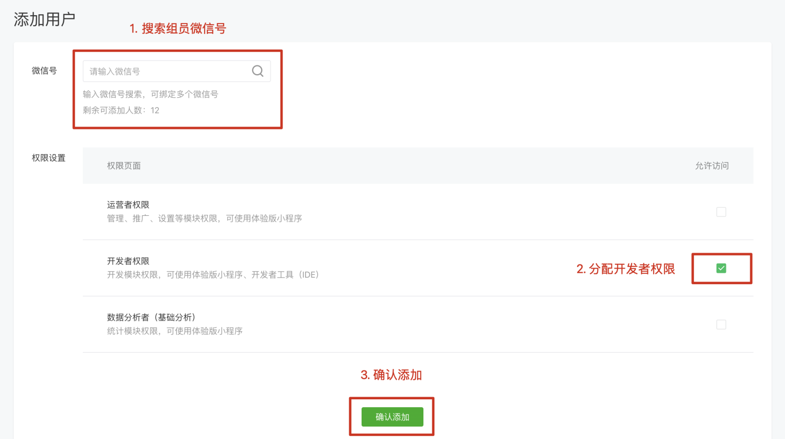
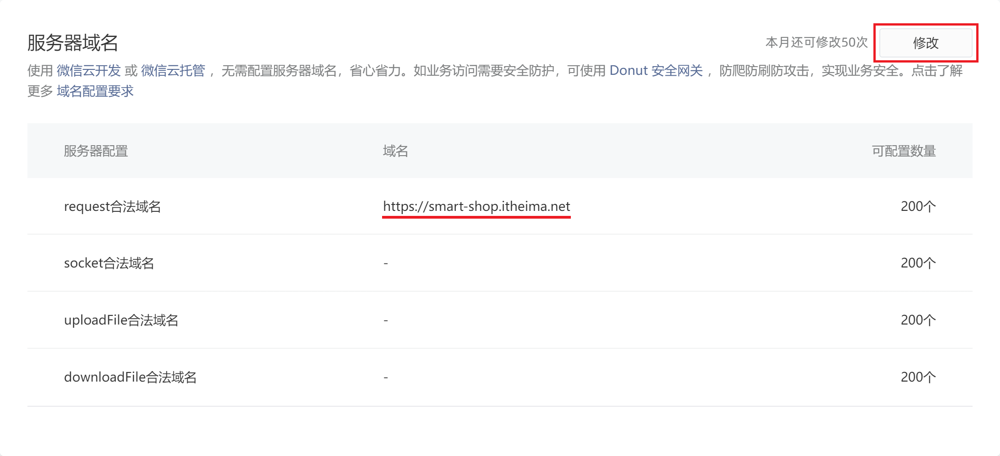
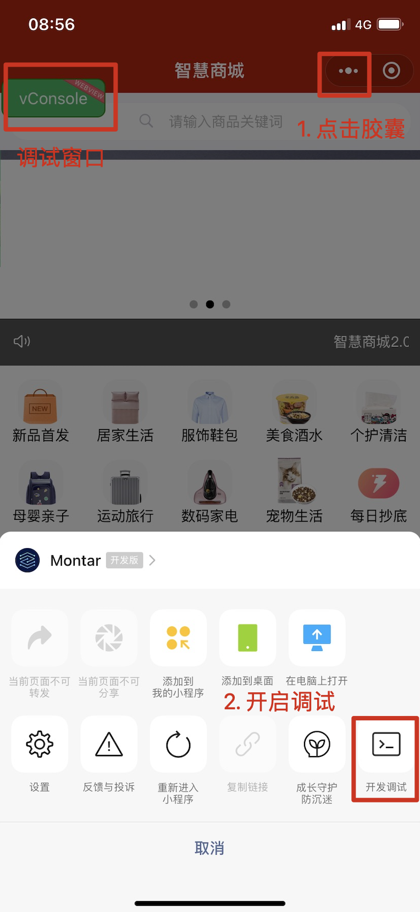

# 项目配置

## 项目 AppID 配置

1. **组长**(管理员)登录自己微信小程序后台
2. **小组成员**提供自己的微信号给组长

组长添加组员为**项目成员**，这样组员才能使用组长填入的 AppID 开发小程序

## 配置服务器域名

【智慧商城】[接口文档地址](https://apifox.com/apidoc/shared-dead2bca-2509-43dc-a4de-ede5218058a1)

**组长**登录小程序后台登记后台 API 请求合法域名：`https://smart-shop.itheima.net`

## 真机预览/调试

真机预览/调试如果出现白屏，需要开启**开发模式**才能正常预览。

