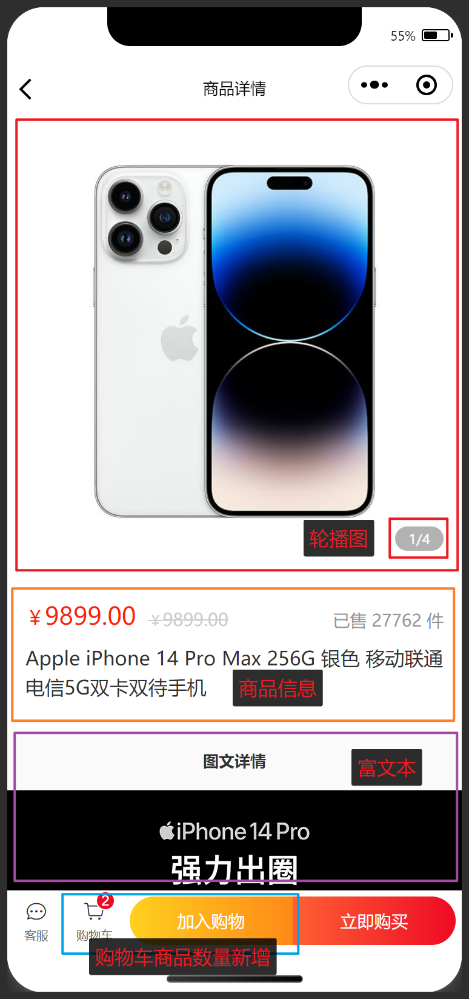
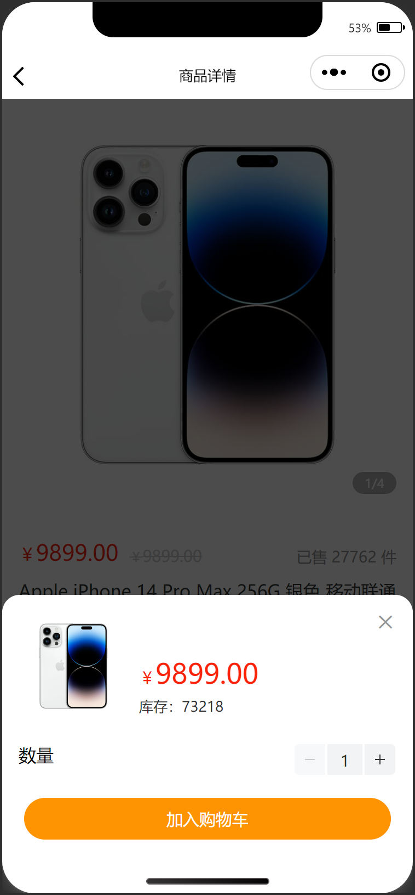
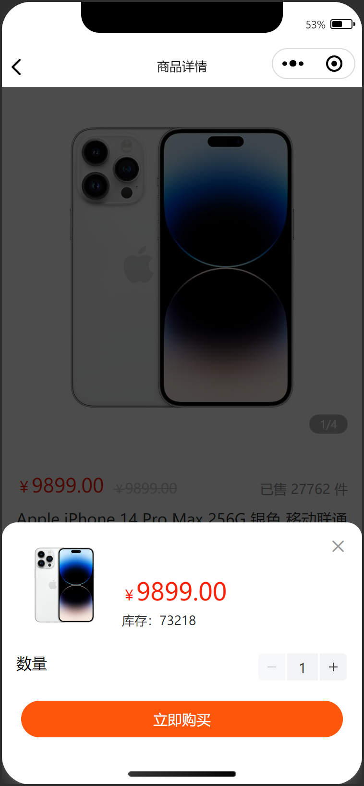

# 商品详情

## 任务目标

1. 完成商品详情页布局
2. 完成数据请求和渲染
3. 实现轮播图的数字切换效果
4. 实现弹出层交互效果
5. 实现加入购物车（需要登录）
6. 实现立即购买功能（需完成订单结算）

[参考效果](https://smart-shop.itheima.net/#/pages/goods/detail?goodsId=10039)

<!--  -->

<table style="text-align:center;">
  <tr>
    <td>
      首屏
    </td>
    <td>
      二屏
    </td>
  </tr>
  <tr>
    <td>
      
    </td>
    <td>
      
    </td>
  </tr>
  <tr>
    <td>
      加入购物车
    </td>
    <td>
      立即购买
    </td>
  </tr>
  <tr>
    <td>
      
    </td>
    <td>
      
    </td>
  </tr>
</table>

## 资料速查

**布局**

- [flex 布局](https://developer.mozilla.org/zh-CN/docs/Web/CSS/CSS_flexible_box_layout/Basic_concepts_of_flexbox)
- [CSS 变量](https://developer.mozilla.org/zh-CN/docs/Web/CSS/Using_CSS_custom_properties)
- [swiper 滑块视图容器](https://developers.weixin.qq.com/miniprogram/dev/component/swiper.html)
- [button 客服按钮 - 微信开放能力](https://developers.weixin.qq.com/miniprogram/dev/component/button.html)
- [rich-text 富文本](https://developers.weixin.qq.com/miniprogram/dev/component/rich-text.html)
- [mp-html 一个强大的小程序富文本组件](https://www.npmjs.com/package/mp-html)
- [van-stepper 步进器](https://vant-contrib.gitee.io/vant-weapp/#/stepper)
- [van-popup 弹出层](https://vant-contrib.gitee.io/vant-weapp/#/popup)
- [van-goods-action 商品导航](https://vant-contrib.gitee.io/vant-weapp/#/goods-action)

**逻辑**

- [mark 事件传参](https://developers.weixin.qq.com/miniprogram/dev/framework/view/wxml/event.html#mark)
- [网络请求 - wechat-http](https://www.npmjs.com/package/wechat-http)
- [接口文档-获取商品详情](https://apifox.com/apidoc/shared-dead2bca-2509-43dc-a4de-ede5218058a1/api-97252183)
- [接口文档-添加商品到购物车](https://apifox.com/apidoc/shared-dead2bca-2509-43dc-a4de-ede5218058a1/api-97252189)
- [接口文档-获取购物车商品总数量](https://apifox.com/apidoc/shared-dead2bca-2509-43dc-a4de-ede5218058a1/api-97252184)
