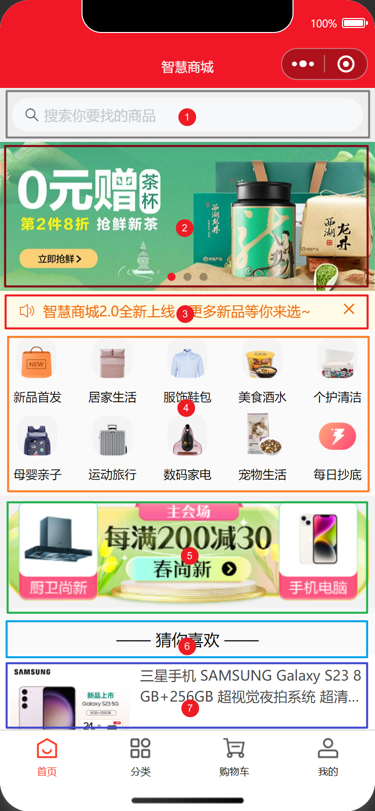

# 首页

## 任务目标

1. 完成首页布局
2. 完成数据请求和渲染
3. 抽离搜索组件，分类页面复用，实现搜索功能和结果展示

[参考效果](https://smart-shop.itheima.net/#/)

<!-- ## 实现细节

1. 搜索框，当组件滚出屏幕范围时，始终会固定在屏幕顶部
2. 图片轮播，图片不能变形，有轮播指示点，无缝轮播，自动轮播
3. 店铺公告，自动滚动播放
4. 导航组，flex 换行布局
5. 图片广告，广告图宽度固定，高度自适应
6. 富文本标题，由后端返回，前端负责渲染
7. 商品组，图片不能变形，文字超出两行省略，商品原价格条件渲染 -->

<!--  -->

<table style="text-align:center;">
  <tr>
    <td>
      首屏
    </td>
    <td>
      二屏
    </td>
  </tr>
  <tr>
    <td>
      
    </td>
    <td>
      
    </td>
  </tr>
</table>

## 资料速查

**布局**

- [flex 布局](https://developer.mozilla.org/zh-CN/docs/Web/CSS/CSS_flexible_box_layout/Basic_concepts_of_flexbox)
- [CSS 变量](https://developer.mozilla.org/zh-CN/docs/Web/CSS/Using_CSS_custom_properties)
- [swiper 滑块视图容器](https://developers.weixin.qq.com/miniprogram/dev/component/swiper.html)
- [rich-text 富文本](https://developers.weixin.qq.com/miniprogram/dev/component/rich-text.html)
- [van-search 搜索组件](https://vant-contrib.gitee.io/vant-weapp/#/search)
- [van-sticky 粘性布局](https://vant-contrib.gitee.io/vant-weapp/#/sticky)
- [van-notice-bar 通知栏](https://vant-contrib.gitee.io/vant-weapp/#/notice-bar)

**组件封装**

- [指南 - 自定义组件](https://developers.weixin.qq.com/miniprogram/dev/framework/custom-component/)
- [框架 - Component](https://developers.weixin.qq.com/miniprogram/dev/reference/api/Component.html)

**逻辑**

- [网络请求 - wechat-http](https://www.npmjs.com/package/wechat-http)
- [接口文档](https://apifox.com/apidoc/shared-dead2bca-2509-43dc-a4de-ede5218058a1/api-97252181)
