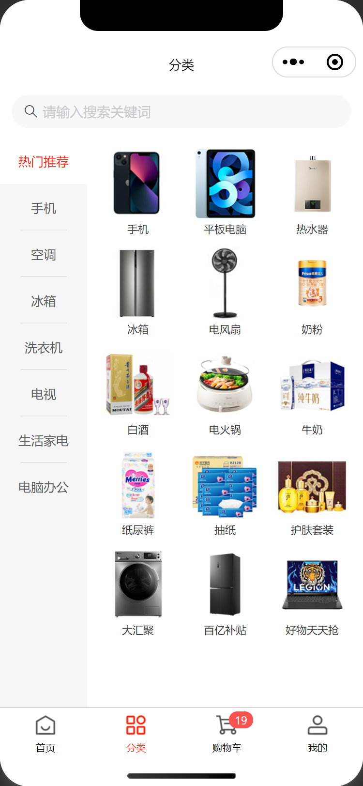
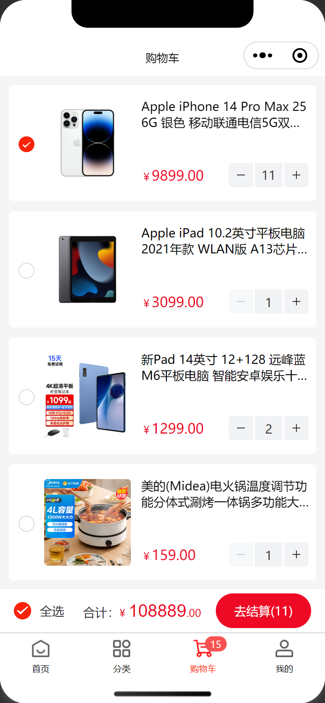
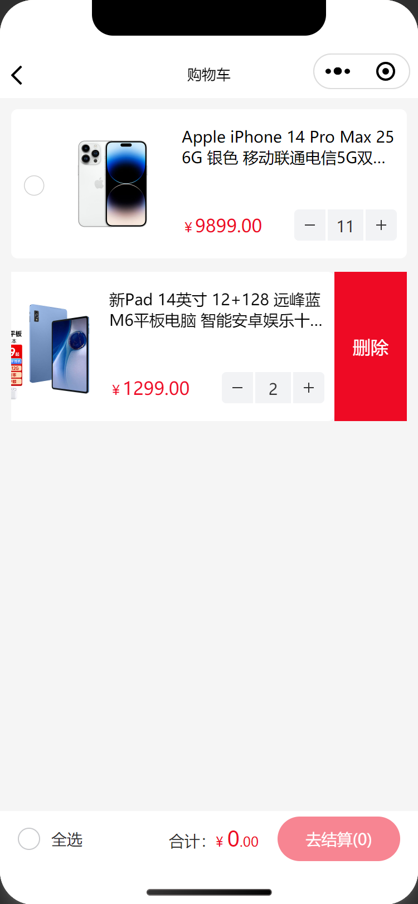
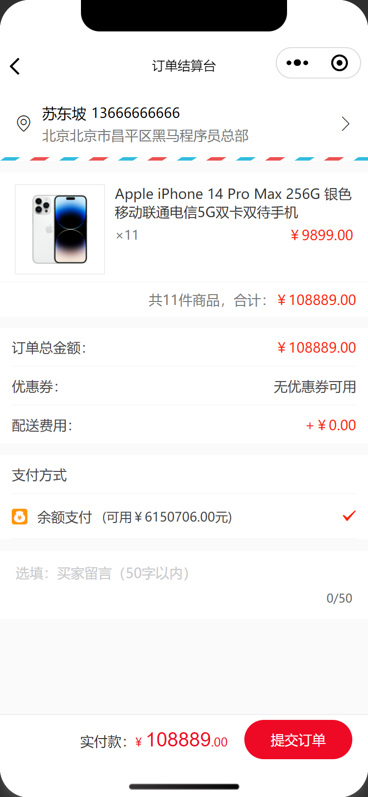
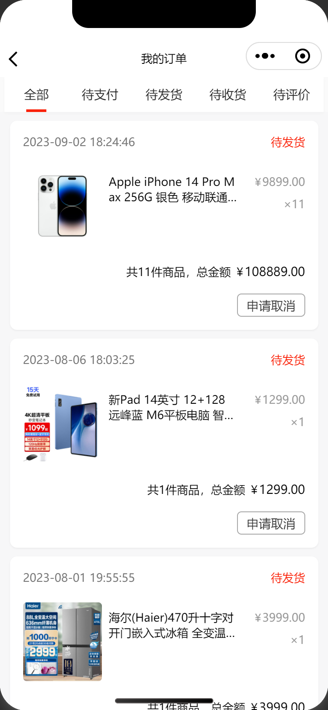

# 智慧商城 - 项目实战

## 实战目的

实战的目标是模拟真实企业开发，了解开发流程和注意事项，提前做好工作准备。

1. 锻炼独立开发、团队协作、解决问题的能力
2. 熟悉真实企业开发的流程
3. 查漏补缺和自我提升

## 项目介绍

智慧商城是一个小程序电商购物网站，用户可以方便快捷的网上购物，主要有首页、分类、购物车、我的等业务模块，技术栈以原生小程序技术为主配合了 [Vant 组件库](https://vant-contrib.gitee.io/vant-weapp/)，[Mobx 全局状态管理](https://www.npmjs.com/package/mobx-miniprogram-bindings)。

## 资料说明

### 📗 接口文档

[https://apifox.com/apidoc/shared-dead2bca-2509-43dc-a4de-ede5218058a1](https://apifox.com/apidoc/shared-dead2bca-2509-43dc-a4de-ede5218058a1)

### ✏️ 在线笔记

[https://megasu.gitee.io/mini-app-note/wisdom-shop/](https://megasu.gitee.io/mini-app-note/wisdom-shop/)

### 📦 项目源码

[https://gitee.com/Megasu/wisdom-shop-mini-app](https://gitee.com/Megasu/wisdom-shop-mini-app)

## 项目演示

智慧商城 H5 端已开发完成，实战目标是微信小程序端。

[点击体验 H5 端](https://smart-shop.itheima.net)

<table style="text-align:center;">
  <tr>
    <td>
      
    </td>
    <td>
      
    </td>
    <td>
      
    </td>
    <td>
      
    </td>
  </tr>
  <tr>
    <td>
      
    </td>
    <td>
      
    </td>
    <td>
      
    </td>
    <td>
      
    </td>
  </tr>
</table>

## 技术栈

原生微信小程序 + MobX 状态管理 + Vant Weapp 组件库

说明：开发期间学会多查相关技术文档。

- [微信官方文档 - 小程序](https://developers.weixin.qq.com/miniprogram/dev/framework/)
- [微信官方文档 - npm 支持](https://developers.weixin.qq.com/miniprogram/dev/devtools/npm.html)
- [小程序自定义组件 computed / watch 扩展](https://www.npmjs.com/package/miniprogram-computed)
- [小程序的 MobX 绑定辅助库 - 全局状态管理库](https://www.npmjs.com/package/mobx-miniprogram-bindings)
- [微信官方文档 - 框架扩展 - 官方出品](https://developers.weixin.qq.com/miniprogram/dev/platform-capabilities/extended/utils/computed.html)
- [Vant Weapp 组件库官网](https://vant-contrib.gitee.io/vant-weapp/)
