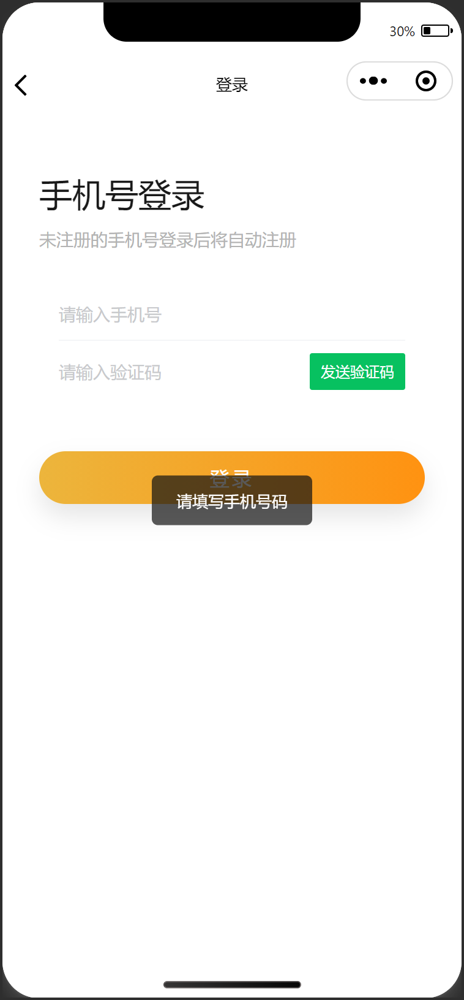
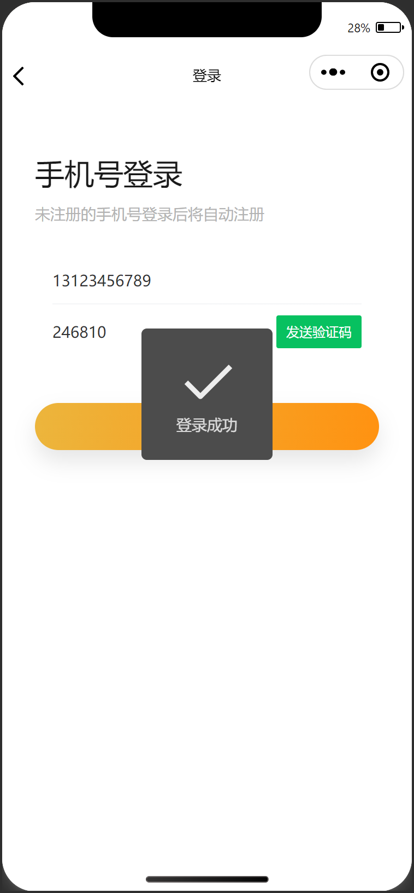

# 登录

## 任务目标

1. 使用 [wechat-validate](https://www.npmjs.com/package/wechat-validate) 实现表单校验
2. 验证码（练习使用：`246810`）
3. 登录成功，存储 token 到本地存储，回跳到未登录之前的页面

[参考效果](https://smart-shop.itheima.net/#/pages/login/index)

<!--  -->

<table style="text-align:center;">
  <tr>
    <td>
      表单校验
    </td>
    <td>
      成功提示
    </td>
  </tr>
  <tr>
    <td>
      
    </td>
    <td>
      
    </td>
  </tr>
</table>

## 资料速查

**布局**

- [flex 布局](https://developer.mozilla.org/zh-CN/docs/Web/CSS/CSS_flexible_box_layout/Basic_concepts_of_flexbox)
- [CSS 变量](https://developer.mozilla.org/zh-CN/docs/Web/CSS/Using_CSS_custom_properties)
- [van-field 输入框](https://vant-contrib.gitee.io/vant-weapp/#/field)
- [van-button 按钮](https://vant-contrib.gitee.io/vant-weapp/#/button)

**逻辑**

- [网络请求 - wechat-http](https://www.npmjs.com/package/wechat-http)
- [表单校验 - wechat-validate](https://www.npmjs.com/package/wechat-validate)
- [接口文档-手机验证码登录](https://apifox.com/apidoc/shared-dead2bca-2509-43dc-a4de-ede5218058a1/api-97252192)
