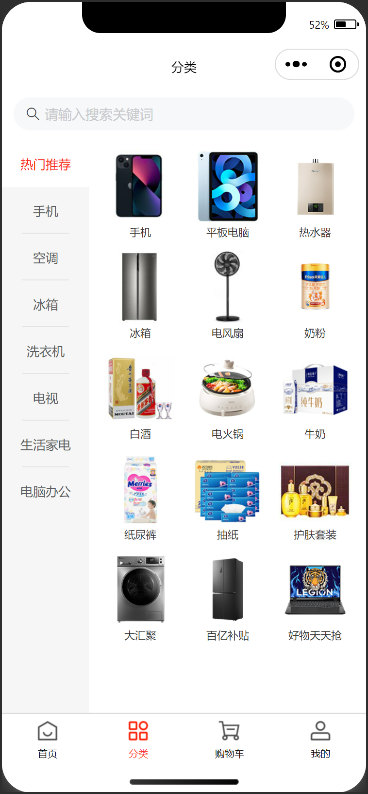
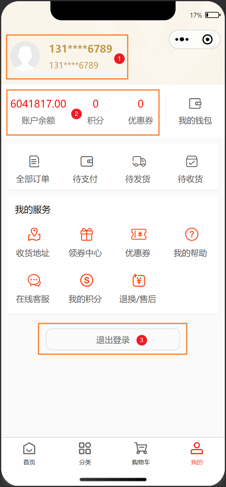
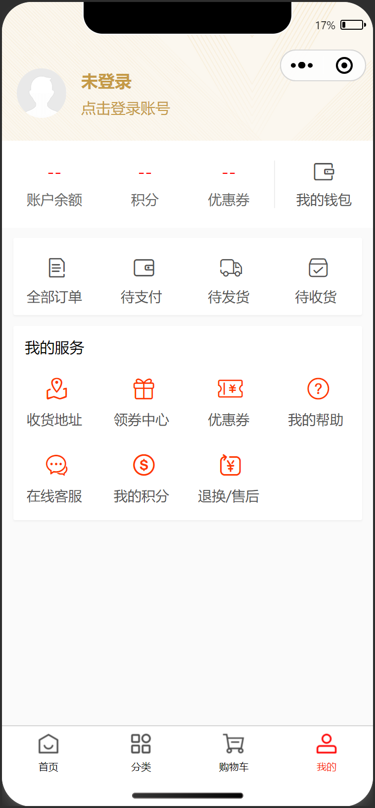

# 我的

## 任务目标

1. 完成页面布局，注意自定义导航栏，需适配不同机型状态栏
2. 获取登录用户信息并渲染
3. 实现退出登录，退出前需二次确认

[参考效果](https://smart-shop.itheima.net/#/pages/user/index)

<!--  -->

<table style="text-align:center;">
  <tr>
    <td>
      登录状态
    </td>
    <td>
      未登录状态
    </td>
  </tr>
  <tr>
    <td>
      
    </td>
    <td>
      
    </td>
  </tr>
</table>

## 资料速查

**布局**

- [flex 布局](https://developer.mozilla.org/zh-CN/docs/Web/CSS/CSS_flexible_box_layout/Basic_concepts_of_flexbox)
- [CSS 变量](https://developer.mozilla.org/zh-CN/docs/Web/CSS/Using_CSS_custom_properties)

**逻辑**

- [获取系统信息 API](https://developers.weixin.qq.com/minigame/dev/api/base/system/wx.getSystemInfoSync.html)
- [显示模态对话框 API](https://developers.weixin.qq.com/miniprogram/dev/api/ui/interaction/wx.showModal.html)
- [移除 tabBar 某一项右上角的文本 API](https://developers.weixin.qq.com/miniprogram/dev/api/ui/tab-bar/wx.removeTabBarBadge.html)
- [网络请求 - wechat-http](https://www.npmjs.com/package/wechat-http)
- [接口文档-手机验证码登录](https://apifox.com/apidoc/shared-dead2bca-2509-43dc-a4de-ede5218058a1/api-97252192)
