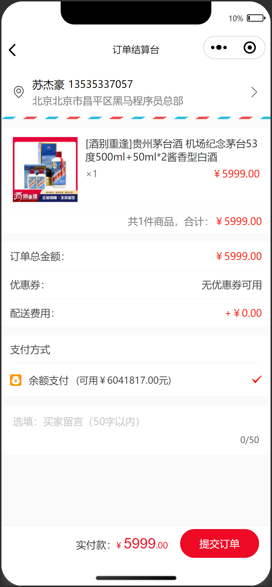
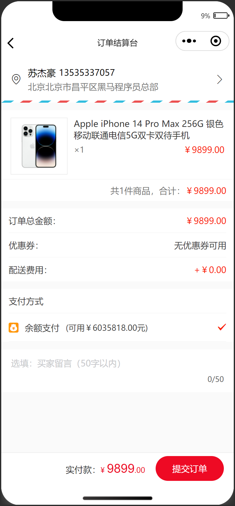
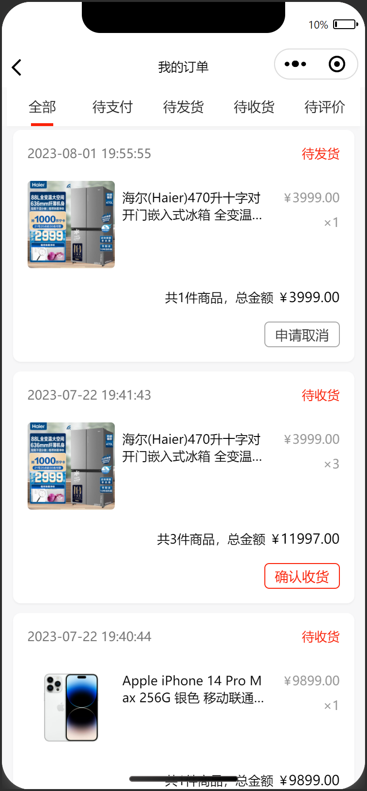

# 订单

## 任务目标

1. 完成 订单结算台 页面布局，页面渲染，实现支付订单
2. 完成 订单列表 页面布局，点击 tabs 切换列表
3. 根据不同参数请求不同订单列表
4. 根据不同订单状态条件渲染订单状态文字和操作按钮

[参考效果](https://smart-shop.itheima.net/#/pages/order/index?dataType=all)

<!--  -->

<table style="text-align:center;">
  <tr>
    <td>
      订单结算台
    </td>
    <td>
      订单结算台
    </td>
  </tr>
  <tr>
    <td>
      
    </td>
    <td>
      
    </td>
  </tr>
  <tr>
    <td>
      订单列表-全部
    </td>
    <td>
      订单列表-切换
    </td>
  </tr>
  <tr>
    <td>
      
    </td>
    <td>
      
    </td>
  </tr>
</table>

## 资料速查

**布局**

- [flex 布局](https://developer.mozilla.org/zh-CN/docs/Web/CSS/CSS_flexible_box_layout/Basic_concepts_of_flexbox)
- [CSS 变量](https://developer.mozilla.org/zh-CN/docs/Web/CSS/Using_CSS_custom_properties)

**逻辑**

- [网络请求 - wechat-http](https://www.npmjs.com/package/wechat-http)
- [接口文档-手机验证码登录](https://apifox.com/apidoc/shared-dead2bca-2509-43dc-a4de-ede5218058a1/api-97252192)
