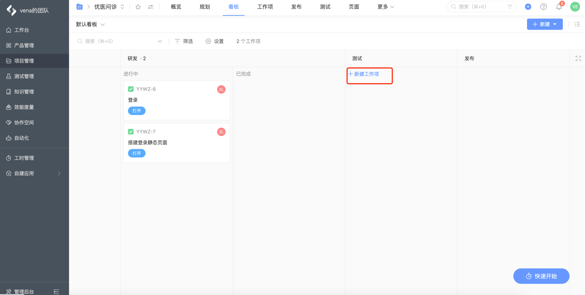

# PingCode 使用指南

PingCode 是简单易用的新一代研发管理平台，让研发管理自动化、数据化、智能化，帮助企业提升研发效能。

## 准备工作

### 团队负责人 👑：创建组织/团队

1. 点击链接注册组织 https://pingcode.com/signup
2. 填写手机号码和验证码
3. 选择**个人注册**

### 团队负责人 👑：邀请团队成员

1. 进入组织后自动弹出添加成员邀请，选择**链接邀请**，并**复制**邀请链接发送给团队成员

::: tip
如果关闭了弹窗，可在 **管理后台-成员-添加成员** 重新获取邀请链接
:::

### 团队成员 🎓：接受邀请

1. 团队成员点击链接后，输入自己的信息即可加入团队

## 权限和任务

### 团队负责人 👑：成员权限配置

1. 进入管理后台，点击成员菜单，选择设置成员信息

2. 为成员选择相应的职位并确定，选择后成员才能拥有权限。

### 团队负责人 👑：创建项目并在项目中加入团队成员

1. 项目负责人点击**项目管理**页面中的新建项目

2. 输入项目名称，例如“优医问诊”，项目类型选择 **Kanban 项目**，并点击下一步。

3. 选择添加成员，并选中部门中的想要添加团队成员，点击确定，项目创建成功。

### 团队负责人/团队成员：分配任务

1. 在一级菜单中选择**项目管理**，并选择需要研发的项目，点击进入该项目的详情页。

2. 在看板页面，选择新建任务，填写研发任务字段并指派给对应团队成员即可。

## 任务状态

### 团队成员 🎓：修改任务状态

1. 团队成员可直接点击任务卡片修改任务状态

### 团队成员 🎓：提交 bug

1. 看板中点击**新建工作项**，选择“缺陷”，输入相关信息并指定相关人，保存后，缺陷提交成功。

2. 选择卡片的快捷操作，可以填写 bug 优先级，修改状态，开始时间和截止时间。

### 团队成员 🎓：修改 bug 状态

1. 可以在**看板**页面，点击卡片修改 bug 状态。

2. 也可以在**工作台**进行状态修改。

