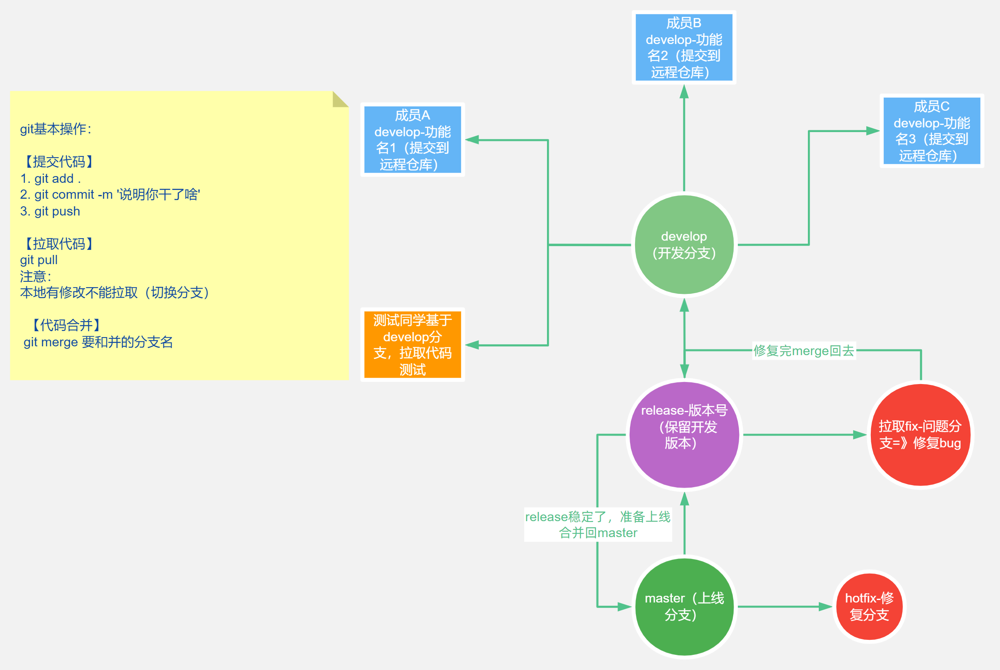
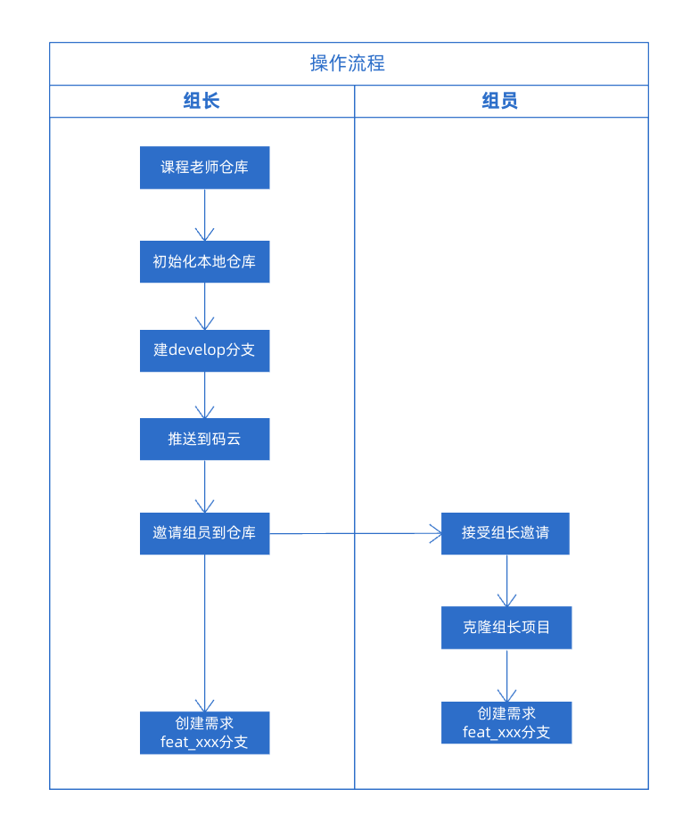

# 实战安排

## 开发说明

独立完成功能、分析解决 bug、团队协作

1. 结合项目需求和接口文档、线上演示分析实现步骤和使用的技术
2. 善于使用 [vant-weapp](https://vant-contrib.gitee.io/vant-weapp/) 组件库
3. 开发中遇到的 bug 小组成员配合解决

::: tip 温馨提示
善于利用文档、搜索引擎等工具；团队沟通协作
:::

## 时间安排

实战期间时间各组自己安排，各组组长统筹管理，保障项目完成

## 团队组成（了解）

团队组成(全配):产品 PM、设计 UI、交互 UE、前端 FE、后端 RD 、测试 QA 、运维 OP

1.  产品 PM：技术+表达+原型图设计+PS+xmind->产出的结果 prd(产品需求文档)+原型图
2.  设计 UI：用户页面设计师->psd 设计稿、sketch 设计稿(高保真)
3.  交互 UE：用户/视觉体验设计师->交互稿
4.  前端 FE：（切图=>html）
    - PC Web
    - Mobile Web（h5）
    - 小程序
    - 公众号
    - 混合 app(hybrid) => 原生页面和 h5 页面
      - 基于 vue 的 Weex 框架
      - 基于 react 的 RN 框架
      - 安卓/iOS：app 下的 H5 页面，通过 webview(iframe)嵌入和原生代码通信
    - node.js（后端）=>express/koa(接口)
5.  后端 RD：
    - 接口和数据库开发->express/koa/python/java/php...
    - 数据库管理和维护(DBA)
6.  测试 QA：自动化测试+测试用例编写
    - 开发->自测->提测->测试->反馈 bug->修改->复测->验收通过
    - 最好不要出现 S 级的 bug(导致整个软件不能使用的 bug)
7.  运维 OP：管理网络和服务器+项目上线+后期维护

## Git 工作流

企业中项目开发管理代码和分支的方案

### Git 常用命令

[Git 常用命令](./git)

### 图示

### 操作步骤

1. 组长创建项目和分支，推送到远端仓库
   - master（上线分支）
   - release-XX（发布版本分支）
   - dev(开发分支)
2. 组员克隆组长仓库，拉取分支（注意：跟远端建立连接）
3. 基于 dev 新建自己的个人开发分支，然后推送到远端仓库=>基于自己的分支开发
4. 开发完，先把自己分支的代码 push 到远端，然后切换 dev 进行合并
5. 合并之前，先 `git pull` 拉更新；然后执行 `git merge` 自己的分支名，最后 `git push`
6. 运行 dev 分支代码测试=>`npm run serve` => 看看代码运行是否正常，代码在否
7. 合并完毕，中间出现 bug，回到个人分支修复后，**重复 4-6 部操作**
8. 等到 dev 分支包含所有人的代码，然后合并到 release 分支准备上线
9. 上线前在 release 分支，做最后的全功能测试
   - 如果出现 bug 直接在 release 分支拉取单独分支修复后，再合并回去
10. 最终把 release 分支的代码合并到 master 上线

::: warning 注意

1. 组长建立仓库是开源的，实战期间不要建立私有仓库
2. 开发中接口文档会有错误，以线上演示接口调用传参为准
3. 合并代码，和别人出现冲突要和当事人确认，共同进行合并
4. 冲突合并，可以借助 VS Code 分支管理，进行解决
5. 解决完冲突，需要再次暂存提交，最后把代码提交到远程仓库

:::

## 实战开始

### 第一步：创建协作仓库（组长）

**组长** 下载实战代码：

- 使用 git 初始化仓库，在 master 分支基础上新建 develop 分支
- 在码云新建仓库，推送 master 、develop 分支到码云
- 组长 在码云邀请小组成员加入仓库
- 组员 接受邀请，且克隆 组长 仓库到本地，注意不是老师的仓库

### 第二步：准备开发分支

::: warning 注意
组员克隆组长仓库，默认只有 master 默认分支，需要先拉取远端 develop 分支代码

`git checkout develop`
:::

- 所有人 切换到 develop 分支，根据自己领取的任务基于 develop 新建自己的开发分支
  - `git branch feat_index`
  - 首页模块 feat_index
  - 分类模块 feat_category
- 开发环境
  - `npm install` 安装依赖
  - `npm run dev` 启动项目

### 第三步：进行代码开发

按照 [PingCode](https://pingcode.com/) 任务按时开发

### 第四步：Code Review

- 开发完毕，可以让整个小组参与 code review
- 调整完毕，切换到 develop 分支
- 合并代码，`git merge feat_xxx` 需求开发分支
- 要求：每天合并代码时，要求所有组员围观组长合并（1 是为了学习 2 是为了解决合并时出现的问题）

::: warning 注意
冲突原因，一般两个人改了**同一个文件**相同位置的代码。

例如：两个 feat 分支合并到 develop，合并出现冲突要**和当事人确认**，共同进行合并。
:::

## 早上例会

组长组织，了解进度和问题及今天开发安排。

1. 本组每个人的开发进度情况和问题
2. 组内讨论沟通，协同解决
3. 把进度情况在 PingCode 登记后，把项目看板研发进度截图发班级群

[PingCode 使用指南](./pingcode)

## 答辩总结

最后一天答辩：每组准备一份 PPT 即可，选一名代表进行答辩。

PPT 大纲：

1. 项目介绍：项目背景，成员分工：开发人员（晒照），功能介绍，整体完成度
2. 按照成员分工逐一列出每个人开发成果（需要演示）：
   - 技术亮点&难点：（可挑选部分内容讲解代码和业务）（重点说说）
   - 收获&体会（重点说说）
   - 后期学习努力方向和计划

::: tip 说明
每个组员都要总结自己的业务实现和收获体会，组长汇总放到本组 PPT 中
:::
