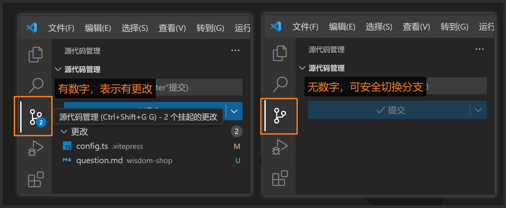

# 常见问题

## 项目导入后报错

原因：项目使用了 `npm` 模块，本地没有下载和构建 npm 包

解决方案：

1. 通过 `npm install` 安装项目依赖
2. 工具 ==> 构建 npm，若构建 npm 失败，请重启微信开发者工具后重试

## 背景图不出来

原因：原生小程序的 `wxss` 不支持导入本地资源(本地图片、本地字体)

解决方案：

- 使用在线图片
- 使用 `<image />` 组件引入本地资源

## 组员误把代码推到 master 分支

原因：没有设置分支保护

解决方案：

- 仓库管理员把 `master` 设置为保护分支，避免再出现类似情况

## 本地无法切换分支

原因：本地有未提交的更改，Git 可能会阻止你切换分支，以免丢失这些更改。

解决方案：

- 如果是**有用的代码**，先完成本地提交，再切换分支
- 如果是**无用的代码**，放弃更改(代码不要了)，再切换分支

::: tip 温馨提醒

切换分支，合并代码等操作的时候，尽可能确保 `VS Code` 左侧的源代码管理器 **无数字**。

:::



## 购物车组件怎么发请求

原因：购物车[页面](https://developers.weixin.qq.com/miniprogram/dev/reference/api/Page.html)抽离成了[**自定义组件**](https://developers.weixin.qq.com/miniprogram/dev/framework/custom-component/component.html)，[组件生命周期](https://developers.weixin.qq.com/miniprogram/dev/framework/custom-component/lifetimes.html#定义生命周期方法)，[组件所在页面的生命周期](https://developers.weixin.qq.com/miniprogram/dev/framework/custom-component/lifetimes.html#组件所在页面的生命周期)，[样式共享](https://developers.weixin.qq.com/miniprogram/dev/framework/custom-component/wxml-wxss.html#组件样式隔离) 和 [组件方法](https://developers.weixin.qq.com/miniprogram/dev/framework/custom-component/component.html)写法和页面不一样

```js {4,9,11,13,19}
// 注册组件用 Component()
Component({
  options: {
    // 允许组件使用页面的样式
    addGlobalClass: true,
  },
  // 组件的内部数据
  data: {},
  // 组件生命自身的周期写在 lifetimes 中
  lifetimes: {},
  // 组件所在页面的生命周期写在 pageLifetimes 中
  pageLifetimes: {
    // 页面显示，注意这里不是 onShow
    show() {
      // 获取购物车列表
      this.getCartList()
    },
  },
  // 组件方法写在 methods 中
  methods: {
    async getCartList() {
      // 获取购物车列表
    },
  },
})
```
